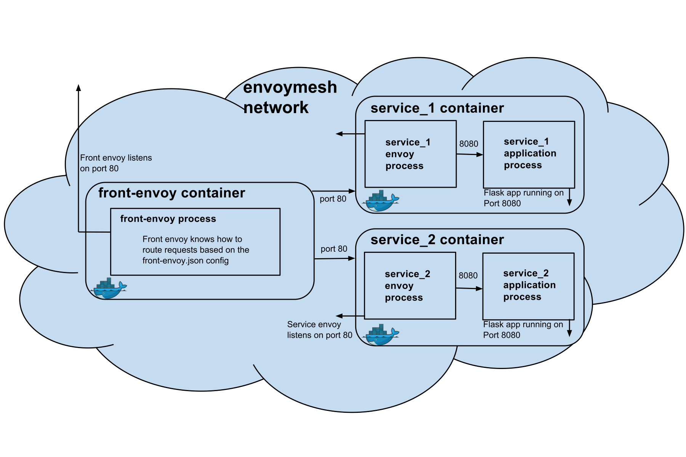

# Envoy 作为前端代理

 **注意：本书中的 Service Mesh 章节已不再维护，请转到 [istio-handbook](https://jimmysong.io/istio-handbook) 中浏览。**

本文是使用 Envoy 作为前端代理的介绍，仅使用 docker 容器和 docker-compose 做编排在单机中运行，帮助我们从更底层了解 Envoy，当我们将 Envoy 作为 Istio Service Mesh 的 data panel 的时候将更加游刃有余。

## 快速开始

Envoy 中的所有规则配置跟 Kubernetes 一样都是通过 YAML 文件来完成的。在继续下面的步骤之前，首先克隆 Envoy 的 GitHub repo。

```bash
git clone https://github.com/envoyproxy/envoy.git
```

## 运行 sandbox 测试

Envoy 官方提供了以下打包用例：

- [Front Proxy](https://www.envoyproxy.io/docs/envoy/latest/start/sandboxes/front_proxy)
- [Zipkin Tracing](https://www.envoyproxy.io/docs/envoy/latest/start/sandboxes/zipkin_tracing)
- [Jaeger Tracing](https://www.envoyproxy.io/docs/envoy/latest/start/sandboxes/jaeger_tracing)
- [gRPC Bridge](https://www.envoyproxy.io/docs/envoy/latest/start/sandboxes/grpc_bridge)

全部可以使用 `docker-compose` 运行，代码可以在 https://github.com/envoyproxy/envoy/tree/master/examples 找到。

## Front proxy

Envoy 在 envoymesh 的边缘做反向代理，详细使用方式见 <https://www.envoyproxy.io/docs/envoy/latest/start/sandboxes/front_proxy>，在此我将解说下以下问题：

- Envoy 是如何作为进程外架构运行的？
- 为何说 Envoy 是无侵入式架构？
- Envoy 作为边缘反向代理能做什么？

本示例的架构图如下所示，此时 Envoy 将作为一个反向代理，类似于 Nginx，但与 Nginx 不同的是它还会作为一个进程，伴随每个服务一起运行在同一个容器中（在 Kubernetes 中可以作为 Sidecar 与应用容器一起运行在同一个 Pod 中）。



在此示例中一共有 3 个服务，我们需要为其创建容器编排的 `docker-compose.yml` 文件。

```yaml
version: '2'
services:

  front-envoy:
    build:
      context: .
      dockerfile: Dockerfile-frontenvoy
    volumes:
      - ./front-envoy.yaml:/etc/front-envoy.yaml
    networks:
      - envoymesh
    expose:
      - "80"
      - "8001"
    ports:
      - "8000:80"
      - "8001:8001"

  service1:
    build:
      context: .
      dockerfile: Dockerfile-service
    volumes:
      - ./service-envoy.yaml:/etc/service-envoy.yaml
    networks:
      envoymesh:
        aliases:
          - service1
    environment:
      - SERVICE_NAME=1
    expose:
      - "80"

  service2:
    build:
      context: .
      dockerfile: Dockerfile-service
    volumes:
      - ./service-envoy.yaml:/etc/service-envoy.yaml
    networks:
      envoymesh:
        aliases:
          - service2
    environment:
      - SERVICE_NAME=2
    expose:
      - "80"

networks:
  envoymesh: {}
```

使用 docker-compose 启动可以保证三个服务都在同一个网络内，即 `frontproxy_envoymesh` 网络中。

其中 `front-envoy` 是前端（边缘）Envoy 服务，用来做反向代理，它使用的是 `Dockerfile-frontenvoy` 文件来构建镜像的，我们来看下该 `Dockerfile` 的内容。

```docker
FROM envoyproxy/envoy:latest

RUN apt-get update && apt-get -q install -y \
    curl
CMD /usr/local/bin/envoy -c /etc/front-envoy.yaml --service-cluster front-proxy
```

其中 `/etc/front-envoy.yaml` 是本地的 `front-envoy.yaml` 挂载进去的。我们看下该文件的内容。

```yaml
static_resources:
  listeners:
  - address:
      socket_address:
        address: 0.0.0.0
        port_value: 80
    filter_chains:
    - filters:
      - name: envoy.http_connection_manager
        config:
          codec_type: auto
          stat_prefix: ingress_http
          route_config:
            name: local_route
            virtual_hosts:
            - name: backend
              domains:
              - "*"
              routes:
              - match:
                  prefix: "/service/1"
                route:
                  cluster: service1
              - match:
                  prefix: "/service/2"
                route:
                  cluster: service2
          http_filters:
          - name: envoy.router
            config: {}
  clusters:
  - name: service1
    connect_timeout: 0.25s
    type: strict_dns
    lb_policy: round_robin
    http2_protocol_options: {}
    hosts:
    - socket_address:
        address: service1
        port_value: 80
  - name: service2
    connect_timeout: 0.25s
    type: strict_dns
    lb_policy: round_robin
    http2_protocol_options: {}
    hosts:
    - socket_address:
        address: service2
        port_value: 80
admin:
  access_log_path: "/dev/null"
  address:
    socket_address:
      address: 0.0.0.0
      port_value: 8001
```

我们看到其中包括了三大配置项：

- **static_resources**：路由配置信息
- **cluster**：envoymesh 的服务注册信息
- **admin**：管理接口，可以通过访问 8001 端口的，访问 `/stats`  获取当前 envoymesh 的一些统计信息，访问 `/server_info` 获取 Envoy 的版本信息

使用 `docker-compose` 启动三个容器。

```bash
$ pwd
envoy/examples/front-proxy
$ docker-compose up --build -d
$ docker-compose ps
        Name                       Command               State      Ports
-------------------------------------------------------------------------------------------------------------
example_service1_1      /bin/sh -c /usr/local/bin/ ... Up       80/tcp
example_service2_1      /bin/sh -c /usr/local/bin/ ... Up       80/tcp
example_front-envoy_1   /bin/sh -c /usr/local/bin/ ... Up       0.0.0.0:8000->80/tcp, 0.0.0.0:8001->8001/tcp
```

我们下面将过一遍 Envoy 作为前端代理的所有功能，这些功能是通用功能。

### 路由

访问 service1 <http://localhost:8000/service/1> 将看到如下输出。

```bash
$ curl -v localhost:8000/service/1
*
Trying ::1...
* TCP_NODELAY set
* Connected to localhost (::1) port 8000 (#0)
> GET /service/1 HTTP/1.1
> Host: localhost:8000
> User-Agent: curl/7.54.0
> Accept: */*
>
< HTTP/1.1 200 OK
< content-type: text/html; charset=utf-8
< content-length: 89
< server: envoy
< date: Fri, 20 Apr 2018 08:26:33 GMT
< x-envoy-upstream-service-time: 14
<
Hello from behind Envoy (service 1)! hostname: a3e4185a9a49 resolvedhostname: 172.18.0.4
* Connection #0 to host localhost left intact
```

访问 service2 <http://localhost:8000/service/2> 将看到如下输出。

```bash
*   Trying ::1...
* TCP_NODELAY set
* Connected to localhost (::1) port 8000 (#0)
> GET /service/2 HTTP/1.1
> Host: localhost:8000
> User-Agent: curl/7.54.0
> Accept: */*
>
< HTTP/1.1 200 OK
< content-type: text/html; charset=utf-8
< content-length: 89
< server: envoy
< date: Fri, 20 Apr 2018 08:27:27 GMT
< x-envoy-upstream-service-time: 10
<
Hello from behind Envoy (service 2)! hostname: f6650e1911a0 resolvedhostname: 172.18.0.3
* Connection #0 to host localhost left intact
```

我们看到访问请求被路由到了正确的服务后端。

### 负载均衡

增加 service1 的示例数。

```bash
$ docker-compose scale service1=3
WARNING: The scale command is deprecated. Use the up command with the --scale flag instead.
Starting frontproxy_service1_1 ... done
Creating frontproxy_service1_2 ... done
Creating frontproxy_service1_3 ... done

$ docker-compose ps
          Name                        Command               State                            Ports
---------------------------------------------------------------------------------------------------------------------------
frontproxy_front-envoy_1   /usr/bin/dumb-init -- /bin ...   Up      10000/tcp, 0.0.0.0:8000->80/tcp, 0.0.0.0:8001->8001/tcp
frontproxy_service1_1      /bin/sh -c /usr/local/bin/ ...   Up      10000/tcp, 80/tcp
frontproxy_service1_2      /bin/sh -c /usr/local/bin/ ...   Up      10000/tcp, 80/tcp
frontproxy_service1_3      /bin/sh -c /usr/local/bin/ ...   Up      10000/tcp, 80/tcp
frontproxy_service2_1      /bin/sh -c /usr/local/bin/ ...   Up      10000/tcp, 80/tcp
```

我们看到现在 service1 已经有了 3 个实例，现在再访问 service1 <http://localhost:8000/service/1>。

```bash
$ while true;do curl localhost:8000/service/1;sleep 1;done
Hello from behind Envoy (service 1)! hostname: a3e4185a9a49 resolvedhostname: 172.18.0.4
Hello from behind Envoy (service 1)! hostname: fe44dba64122 resolvedhostname: 172.18.0.5
Hello from behind Envoy (service 1)! hostname: c5b9f1289e0f resolvedhostname: 172.18.0.6
Hello from behind Envoy (service 1)! hostname: a3e4185a9a49 resolvedhostname: 172.18.0.4
Hello from behind Envoy (service 1)! hostname: fe44dba64122 resolvedhostname: 172.18.0.5
Hello from behind Envoy (service 1)! hostname: c5b9f1289e0f resolvedhostname: 172.18.0.6
```

我们看到对 service1 的已经有负载均衡了，使用的策略是 `round_robin`，这些都是在 `front-envoy.yaml` 文件中的 `cluster` 项下配置的。

### admin 端点

访问 <http://localhost:8001> 可以看到 Envoy admin 提供以下管理 API 端点。

| 命令                 | 描述                                     |
| -------------------- | ---------------------------------------- |
| /                    | Admin 主页                               |
| /certs               | 打印机器上的 certs                       |
| /clusters            | upstream cluster 状态                    |
| /config_dump         | 输出当前的 Envoy 配置                    |
| /cpuprofiler         | 开启/关闭 CPU profiler                   |
| /healthcheck/fail    | 导致服务失败健康检查                     |
| /healthcheck/ok      | 导致服务通过健康检查                     |
| /help                | 打印管理命令的帮助信息                   |
| /hot_restart_version | 打印热重启兼容版本                       |
| /listeners           | 打印 listener 地址                       |
| /logging             | 查询/更改日志级别                        |
| /quitquitquit        | 退出服务                                 |
| /reset_counters      | 将计数器重置为 1                         |
| /runtime             | 打印运行时值                             |
| /runtime_modify      | 修改运行时值                             |
| /server_info         | 打印服务器版本/状态信息                  |
| /stats               | 打印服务器状态统计信息                   |
| /stats/prometheus    | 打印 prometheus 格式的服务器状态统计信息 |

Envoy 提供了 API 管理端点，可以对 Envoy 进行动态配置，参考 [v2 API reference](https://www.envoyproxy.io/docs/envoy/latest/api-v2/api)。

## 参考

- [Front proxy](https://www.envoyproxy.io/docs/envoy/latest/start/sandboxes/front_proxy)