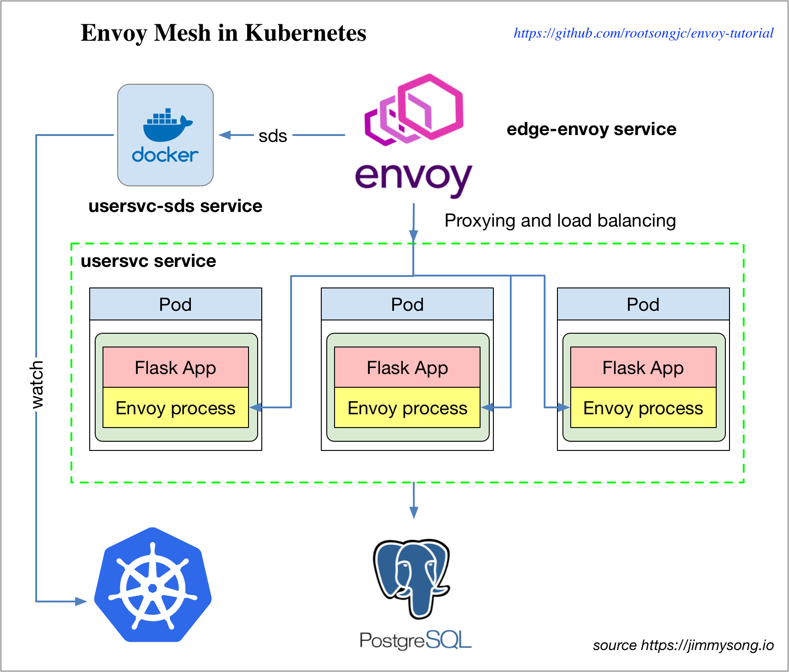

# Envoy mesh 教程

 **注意：本书中的 Service Mesh 章节已不再维护，请转到 [istio-handbook](https://jimmysong.io/istio-handbook) 中浏览。**

本文是在 Kubernetes 集群中，使用 Envoy 来做 mesh，来为一个简单的使用 Python 编写的 Flask 应用程序做反向代理和负载均衡。

**注**：本教程中的示例来自 [envoy-steps](https://github.com/datawire/envoy-steps)，本文中使用的所有的代码和 YAML 配置见 [envoy-tutorial](https://github.com/rootsongjc/envoy-tutorial)。



## 前提条件

使用 [kubernetes-vagrant-centos-cluster](https://github.com/rootsongjc/kubernetes-vagrant-centos-cluster) 部署 kubernetes 集群，只要启动集群并安装了 CoreDNS 即可，无须安装其他插件。

## 部署应用

我们首先将应用部署到 Kubernetes 中。

部署 postgres 数据库。

```bash
kubectl apply -f postgres
```

创建 usersvc 镜像。

```bash
docker build -t jimmysong/usersvc:step1 .
```

部署 usersvc。

```bash
kubectl apply -f usersvc
```

查看 uservc 的 ClusterIP 地址。

```bash
$ kubectl get svc usersvc
kubectl get svc usersvc
NAME      TYPE        CLUSTER-IP       EXTERNAL-IP   PORT(S)    AGE
usersvc   ClusterIP   10.254.176.248   <none>        5000/TCP   11m
```

进到 node1 中访问该服务，因为我们要访问的是 ClusterIP，在我们自己的电脑上是无法直接访问的，所以进到虚拟机中操作。

```bash
$ vagrant ssh node1
$ curl 10.254.176.248:5000
{
  "hostname": "usersvc-7cf5bb9d85-9gx7w",
  "msg": "user health check OK",
  "ok": true,
  "resolvedname": "172.33.10.7"
}
```

尝试添加一个名为 `Alice` 的用户。

```bash
$ curl -X PUT -H "Content-Type: application/json" \
    -d '{ "fullname": "Alice", "password": "alicerules" }' \
    10.254.176.248/user/alice
```

将会看到类似如下的输出。

```json
{
  "fullname": "Alice",
  "hostname": "usersvc-7cf5bb9d85-9gx7w",
  "ok": true,
  "resolvedname": "172.33.10.7",
  "uuid": "EF43B475F65848C6BE708F436305864B"
}
```

尝试再添加一个名为 `Bob` 的用户。

```bash
$ curl -X PUT -H "Content-Type: application/json" \
    -d '{ "fullname": "Bob", "password": "bobrules" }' \
    10.254.176.248/user/bob
```

将会看到类似如下的输出。

```json
{
  "fullname": "Bob",
  "hostname": "usersvc-7cf5bb9d85-9gx7w",
  "ok": true,
  "resolvedname": "172.33.10.7",
  "uuid": "6AC944E7D4254D9A811A82C0FDAC3046"
}
```

当应用部署完毕后，我们该部署 edge envoy 了。

## 部署 edge envoy

部署 edge envoy 的方式很简单，执行下面的命令。

```bash
kubectl apply -f edge-envoy
```

现在访问 edge envoy 是就可以路由到 `usersvc` 上的，当然直接访问 `usersvc` 也是可以的。

我们看下 edge-envoy 的 envoy 配置文件定义。

```json
{
  "listeners": [
    {
      "address": "tcp://0.0.0.0:80",
      "filters": [
        {
          "type": "read",
          "name": "http_connection_manager",
          "config": {
            "codec_type": "auto",
            "stat_prefix": "ingress_http",
            "route_config": {
              "virtual_hosts": [
                {
                  "name": "backend",
                  "domains": ["*"],
                  "routes": [
                    {
                      "timeout_ms": 0,
                      "prefix": "/user",
                      "cluster": "usersvc"
                    }
                  ]
                }
              ]
            },
            "filters": [
              {
                "type": "decoder",
                "name": "router",
                "config": {}
              }
            ]
          }
        }
      ]
    }
  ],
  "admin": {
    "access_log_path": "/dev/null",
    "address": "tcp://127.0.0.1:8001"
  },
  "cluster_manager": {
    "clusters": [
      {
        "name": "usersvc",
        "connect_timeout_ms": 250,
        "type": "strict_dns",
        "service_name": "usersvc",
        "lb_type": "round_robin",
        "features": "http2",
        "hosts": [
          {
            "url": "tcp://usersvc:80"
          }
        ]
      }
    ]
  }
}
```

客户端访问 `edge-envoy` 的 `ClusterIP:8000/user/health` 就可以检查节点的健康状况。

## 部署 usersvc2

删除原来的 `usersvc`，部署第二版 `usersvc2`，它与原来的 `usersvc` 唯一不同的地方是在 `entrypoint` 中集成了 envoy，查看 `Dockerfile` 中指定的 `entrypoint.sh` 的内容便可知。

```bash
#!/bin/sh

python /application/service.py &
/usr/local/bin/envoy -c /application/envoy.json
```

首先删除老的 `usersvc`。

```bash
kubectl delete -f usersvc
```

使用下面的命令部署 `usersvc2`，它仍然使用 `usersvc` 这个 service 名称。

```bash
kubectl apply -f usersvc2
```

Envoy 以 out-of-process 的方式运行，对应用进程没有侵入性，也可以使用 sidecar 的方式运行，让 envoy 与 应用容器运行在同一个 pod 中。

增加 `usersvc2` 的实例个数。

```bash
kubectl scale --replicas=3 deployment/usersvc
```

此时我们有 3 个 usersvc 实例，现在通过 `edge-envoy` 的 `ClusterIP:8000/user/health` 检查节点的健康状况时，是不是会轮询的访问到后端的的 `usersvc2` 的实例呢？

我们当初在 `edge-node` 的 `envoy.json` 中配置过 cluster 的，其中指定了 `lb_type` 为 `round_robin` 。

```json
  "cluster_manager": {
    "clusters": [
      {
        "name": "usersvc",
        "connect_timeout_ms": 250,
        "type": "strict_dns",
        "service_name": "usersvc",
        "lb_type": "round_robin",
        "features": "http2",
        "hosts": [
          {
            "url": "tcp://usersvc:80"
          }
        ]
      }
    ]
  }
```

而且该 `serivce_name` 也可以被 DNS 正确解析。

```bash
root@usersvc-55b6857d44-gcg5c:/application# nslookup usersvc
Server:         10.254.0.2
Address:        10.254.0.2#53

Name:   usersvc.envoy-tutorial.svc.cluster.local
Address: 10.254.123.166
```

**答案是否定的。**

虽然通过 DNS 可以正确的解析出 serivce 的 ClusterIP，但是负载均衡不再通过 kube-proxy 实现，所以不论我们访问多少次 `edge-envoy` 永远只能访问到一个固定的后端 `usersvc`。

## 服务发现服务 - SDS

Kubernetes 中的 DNS 可以发现所有 serivce 的 ClusterIP，但是 DNS 中不包括所有 endpoint 地址，我们需要一个 SDS（服务发现服务）来发现服务的所有的 endpoint，我们将修改 `lb_type`，使用 `sds` 替代 `strict_dns`。

执行下面的命令部署 SDS。

```bash
kubectl apply -f usersvc-sds
```

因为在添加了 SDS 之后需要修改 `edge-envoy` 中的 `envoy.josn` 配置，在 `clusters` 字段中增加 `sds` 信息，我们将所有的配置都写好了，重新打包成了镜像，我们需要先删除之前部署的 `edge-envoy`。

```bash
kubectl delete -f edge-envoy
```

部署新的 `edge-envoy2`。

```bash
kubectl apply -f edge-envoy2
```

连续访问 `usersvc` 12 次看看输出结果如何。

```bash
URL=http://172.17.8.101:30800/user/alice
for i in `seq 1 12`;do curl -s $URL|grep "resolvedname"|tr -d " "|tr -d ","|tr -d '"';done
```

我们可以看到类似如下的输出：

```ini
resolvedname:172.33.71.2
resolvedname:172.33.88.2
resolvedname:172.33.10.2
resolvedname:172.33.71.2
resolvedname:172.33.88.2
resolvedname:172.33.10.2
resolvedname:172.33.71.2
resolvedname:172.33.88.2
resolvedname:172.33.10.2
resolvedname:172.33.71.2
resolvedname:172.33.88.2
resolvedname:172.33.10.2
```

再查看下 `usersvc` 服务的所有 pod 的 IP 地址。

```bash
$ kubectl get pod -l service=usersvc -o wide
NAME                       READY     STATUS    RESTARTS   AGE       IP            NODE
usersvc-55b6857d44-mkfpv   1/1       Running   0          9m        172.33.88.2   node1
usersvc-55b6857d44-q98jg   1/1       Running   0          9m        172.33.71.2   node2
usersvc-55b6857d44-s2znk   1/1       Running   0          9m        172.33.10.2   node3
```

我们看到 round-robin 负载均衡生效了。

## 参考

- [Part 2: Deploying Envoy with a Python Flask webapp and Kubernetes](https://www.datawire.io/envoyproxy/envoy-flask-kubernetes/)
- [envoy-steps](https://github.com/datawire/envoy-steps)
- [kubernetes-vagrant-centos-cluster](https://github.com/rootsongjc/kubernetes-vagrant-centos-cluster) 
- [envoy-tutorial](https://github.com/rootsongjc/envoy-tutorial)