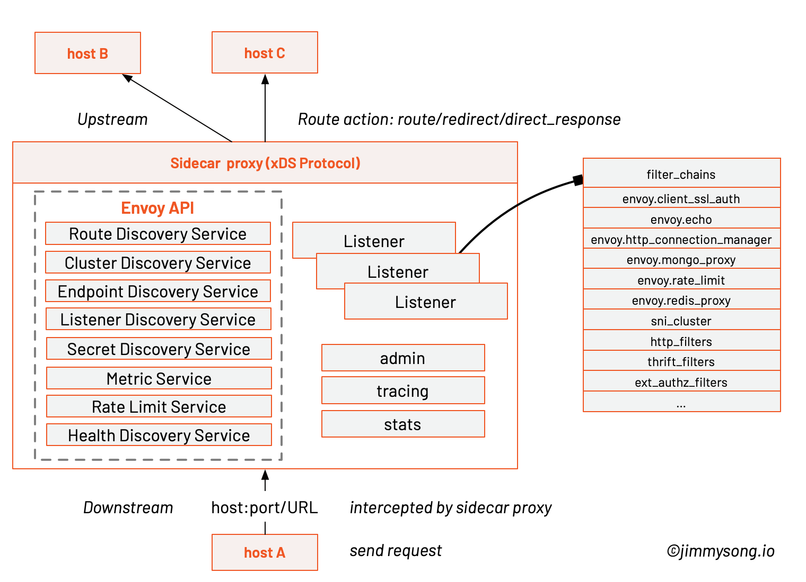

# Envoy 的架构与基本术语

 **注意：本书中的 Service Mesh 章节已不再维护，请转到 [istio-handbook](https://jimmysong.io/istio-handbook) 中浏览。**

在了解一门技术之前一开始就要了解其中的基本概念和术语，只有融入了该语境才能理解这门技术。本文将为大家介绍 Envoy 中的基本术语和重点概念。

## 架构

下图是 Envoy proxy 的架构图，显示了 host B 经过 Envoy 访问 host A 的过程。每个 host 上都可能运行多个 service，Envoy 中也可能有多个 Listener，每个 Listener 中可能会有多个 filter 组成了 chain。



其中的基本术语将在下面解释。

## 基本术语

**Host**：能够进行网络通信的实体（在手机或服务器等上的应用程序）。在 Envoy 中主机是指逻辑网络应用程序。只要每台主机都可以独立寻址，一块物理硬件上就运行多个主机。

**Downstream**：下游（downstream）主机连接到 Envoy，发送请求并或获得响应。

**Upstream**：上游（upstream）主机获取来自 Envoy 的链接请求和响应。

**Cluster**: 集群（cluster）是 Envoy 连接到的一组逻辑上相似的上游主机。Envoy 通过[服务发现](https://www.envoyproxy.io/docs/envoy/latest/intro/arch_overview/service_discovery#arch-overview-service-discovery)发现集群中的成员。Envoy 可以通过[主动运行状况检查](https://www.envoyproxy.io/docs/envoy/latest/intro/arch_overview/health_checking#arch-overview-health-checking)来确定集群成员的健康状况。Envoy 如何将请求路由到集群成员由负载均衡策略确定。

**Mesh**：一组互相协调以提供一致网络拓扑的主机。Envoy mesh 是指一组 Envoy 代理，它们构成了由多种不同服务和应用程序平台组成的分布式系统的消息传递基础。

**运行时配置**：与 Envoy 一起部署的带外实时配置系统。可以在无需重启 Envoy 或 更改 Envoy 主配置的情况下，通过更改设置来影响操作。

**Listener**: 侦听器（listener）是可以由下游客户端连接的命名网络位置（例如，端口、unix域套接字等）。Envoy 公开一个或多个下游主机连接的侦听器。一般是每台主机运行一个 Envoy，使用单进程运行，但是每个进程中可以启动任意数量的 Listener（监听器），目前只监听 TCP，每个监听器都独立配置一定数量的（L3/L4）网络过滤器。Listenter 也可以通过 Listener Discovery Service（**LDS**）动态获取。

**Listener filter**：Listener 使用 listener filter（监听器过滤器）来操作链接的元数据。它的作用是在不更改 Envoy 的核心功能的情况下添加更多的集成功能。Listener filter 的 API 相对简单，因为这些过滤器最终是在新接受的套接字上运行。在链中可以互相衔接以支持更复杂的场景，例如调用速率限制。Envoy 已经包含了多个监听器过滤器。

**Http Route Table**：HTTP 的路由规则，例如请求的域名，Path 符合什么规则，转发给哪个 Cluster。

**Health checking**：健康检查会与SDS服务发现配合使用。但是，即使使用其他服务发现方式，也有相应需要进行主动健康检查的情况。详见 [health checking](https://www.envoyproxy.io/docs/envoy/latest/intro/arch_overview/health_checking)。

## xDS

xDS 是一个关键概念，它是一类发现服务的统称，其包括如下几类：

- CDS：Cluster Discovery Service
- EDS：Endpoint Discovery Service
- SDS：Service Discovery Service
- RDS：Route Discovery Service
- LDS：Listener Discovery Service

正是通过对 xDS 的请求来动态更新 Envoy 配置。

## Envoy Mesh

Envoy Mesh 指的是由 envoy 做负载均衡和代理的 mesh。该 Mesh 中会包含两类 envoy：

- Edge envoy：即流量进出 mesh 时候的 envoy，相当于 kubernetes 中的 ingress。
- Service envoy：服务 envoy 是跟每个 serivce 实例一起运行的，应用程序无感知的进程外工具，在 kubernetes 中会与应用容器以 sidecar 形式运行在同一个 pod 中。

Envoy 即可以单独作为 edge envoy，也可以仅做 service envoy 使用，也可以两者同时使用。Mesh 中的所有 envoy 会共享路由信息。

## Envoy 配置

Envoy 中的配置包括两大类：listenner 配置和 cluster 配置。

### Listener 配置

我们知道 Envoy 中可以配置一组 listener 以实现复杂的处理逻辑。Listener 中设置监听的 TCP 端口，还有一组 filter 对这些端口上的数据流进行处理。如下所示，该示例来自[使用Envoy 作为前端代理](envoy-front-proxy.md)。

```yaml
  listeners:
  - address:
      socket_address:
        address: 0.0.0.0
        port_value: 80
    filter_chains:
    - filters:
      - name: envoy.http_connection_manager
        config:
          codec_type: auto
          stat_prefix: ingress_http
          route_config:
            name: local_route
            virtual_hosts:
            - name: backend
              domains:
              - "*"
              routes:
              - match:
                  prefix: "/service/1"
                route:
                  cluster: service1
              - match:
                  prefix: "/service/2"
                route:
                  cluster: service2
```

这是一个 `http_connection_manager` 例子，其中必须包含 `virtual_hosts` 配置，而 `virtual_hosts` 配置中必须包含以下几项配置：

- `name`：服务名称
- `domains`：DNS 域名，必须能跟 `virtual_host` 的 URL 匹配 
- `routes`：路由列表

每个路由中还可以包含以下配置：

- `prefix`：URL 路径前缀
- `cluster`：处理该请求的 envoy cluster
- `timeout_ms`：当出错时的超时时间

如上面的例子中，我们还需要定义 `service1` cluster 和 `service2` cluster。

### Cluster 配置

Cluster 是一组逻辑相似的主机配置，定义哪些主机属于一个服务，cluster 的配置中包含了服务发现和负载均衡方式配置。依然是参考[使用Envoy 作为前端代理](envoy-front-proxy.md)中的配置：

```yaml
 clusters:
  - name: service1
    connect_timeout: 0.25s
    type: strict_dns
    lb_policy: round_robin
    http2_protocol_options: {}
    hosts:
    - socket_address:
        address: service1
        port_value: 80
  - name: service2
    connect_timeout: 0.25s
    type: strict_dns
    lb_policy: round_robin
    http2_protocol_options: {}
    hosts:
    - socket_address:
        address: service2
        port_value: 80
```

Cluster 的配置中至少包含以下信息：

- `name`：cluster 名称，就是服务名称
- `type`：该 cluster 怎么知道主机是否启动？即服务发现类型，有以下方式：
  - `static`：监听 cluster 中的所有主机
  - `strict_dns`：envoy 会监听 DNS，每个匹配的 A 记录都会认定为有效
  - `logical_dns`：envoy 将使用 DNS 来增加主机，如果 DNS 不再返回该主机也不会删除这些主机信息
  - `sds`：即 Serivce Discovery Serivce，envoy 访问外部的 REST 获取 cluster 成员信息
- `lb_type`：cluster 的负载均衡类型，有以下方式：
  - `round_robin`：轮询主机
  - `weighted_least_request`：最近获得最少请求的主机
  - `random`：随机
- `hosts`：能够定义 cluster 中主机的 URL 地址，通常是`tcp://` URL

## 参考

- [Terminology - www.envoyproxy.io](https://www.envoyproxy.io/docs/envoy/latest/intro/arch_overview/terminology)
- [Part 1: Getting started with Envoy Proxy for microservices resilience](https://www.datawire.io/envoyproxy/getting-started-envoyproxy-microservices-resilience/)
- [Envoy作为前端代理](envoy-front-proxy.md)