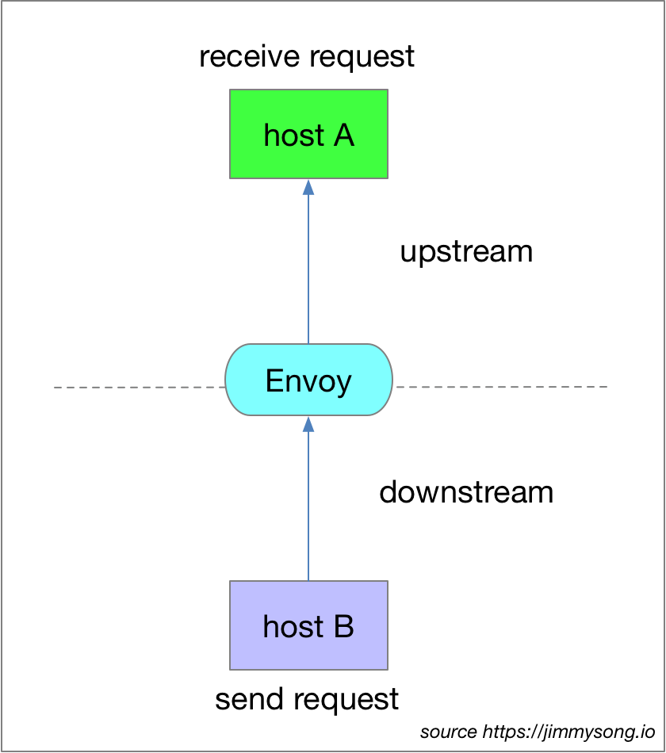

# Envoy 中的基本术语

在了解一门技术之前一开始就要了解其中的基本概念和术语，只有融入了该语境才能理解这门技术。

**Host**：能够进行网络通信的实体（在手机或服务器等上的应用程序）。在 Envoy 中主机是指逻辑网络应用程序。只要每台主机都可以独立寻址，一块物理硬件上就运行多个主机。

**Downstream**：下游（downstream）主机连接到 Envoy，发送请求并或获得响应。

**Upstream**：上游（upstream）主机获取来自 Envoy 的链接请求和响应。

Downstream 和 Upstream 的关系如下图所示。

**Listener**: 侦听器（listener）是可以由下游客户端连接的命名网络位置（例如，端口、unix域套接字等）。Envoy 公开一个或多个下游主机连接的侦听器。

**Cluster**: 集群（cluster）是 Envoy 连接到的一组逻辑上相似的上游主机。Envoy 通过[服务发现](https://www.envoyproxy.io/docs/envoy/latest/intro/arch_overview/service_discovery#arch-overview-service-discovery)发现集群中的成员。Envoy 可以通过[主动运行状况检查](https://www.envoyproxy.io/docs/envoy/latest/intro/arch_overview/health_checking#arch-overview-health-checking)来确定集群成员的健康状况。Envoy 如何将请求路由到集群成员由[负载均衡策略](https://www.envoyproxy.io/docs/envoy/latest/intro/arch_overview/load_balancing#arch-overview-load-balancing)确定。

**Mesh**：一组互相协调以提供一致网络拓扑的主机。Envoy mesh 是指一组 Envoy 代理，它们构成了由多种不同服务和应用程序平台组成的分布式系统的消息传递基础。

**运行时配置**：与 Envoy 一起部署的带外实时配置系统。可以在无需重启 Envoy 或 更改 Envoy 主配置的情况下，通过更改设置来影响操作。

## 参考

- [Terminology - www.envoyproxy.io](https://www.envoyproxy.io/docs/envoy/latest/intro/arch_overview/terminology)