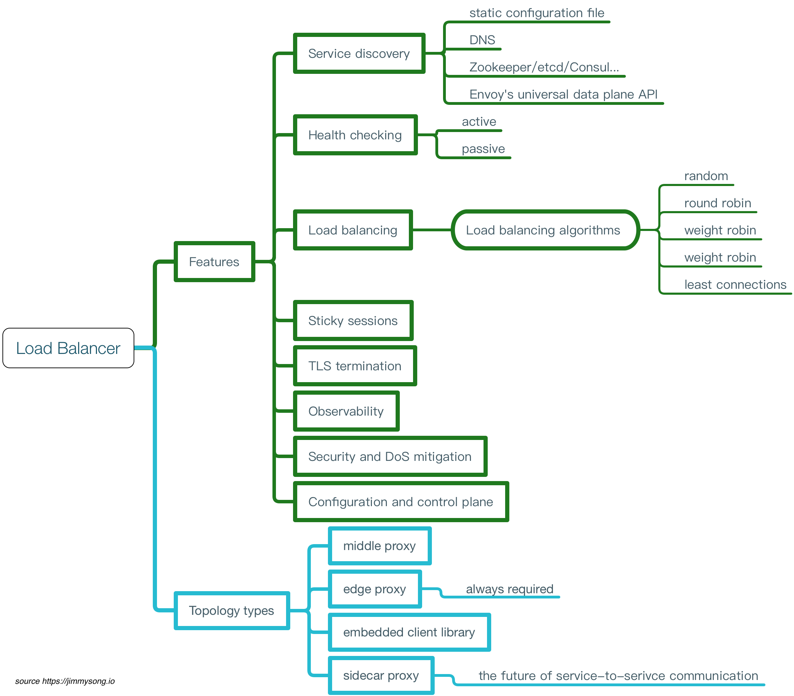

# Envoy

 **注意：本书中的 Service Mesh 章节已不再维护，请转到 [istio-handbook](https://jimmysong.io/istio-handbook) 中浏览。**

[Envoy](https://github.com/envoyproxy/envoy) 是一款由 Lyft 开源的，使用 C++ 编写的 L7 代理和通信总线，目前是 [CNCF](https://cncf.io) 旗下的开源项目且已经毕业，代码托管在 GitHub 上，它也是 [Istio](https://istio.io) service mesh 中默认的 data plane。

ServiceMesher 共同联合翻译了 [Envoy 最新版本的官方文档](https://www.envoyproxy.io/docs/envoy/latest/)，翻译的代码托管在 <https://github.com/servicemesher/envoy>，Envoy 官方文档中文版地址：<http://www.servicemesher.com/envoy/>。

## 特性

Envoy 包括如下特性：

- 进程外架构，不侵入应用进程
- 使用现代版 C++11 代码
- L3/L4 filter 架构
- HTTP L7 filter 架构
- 支持 HTTP/2
- HTTP L7 routing
- 支持 gRPC
- 支持 MongoDB L7
- 动态配置
- 最佳可观测性
- 支持 front/edge proxy
- 高级负载均衡
- 健康检查
- 服务发现
- 支持 DynamoDB L7

Envoy 本身无法构成一个完整的 Service Mesh，但是它可以作为 service mesh 中的应用间流量的代理，负责 service mesh 中的数据层。

## 负载均衡与代理

在 Matt Klein（Envoy 的作者） 的 [Introduction to modern network load balancing and proxying](https://blog.envoyproxy.io/introduction-to-modern-network-load-balancing-and-proxying-a57f6ff80236) 文章详细描述了现代的网络负载均衡与代理的特性与模式，L4 与 L7 负载均衡的区别以及 L7 负载均衡的现状，总结如下图。

Matt Klein 是在他的文章中指出 sidecar 模式的 proxy 将取代另外三种模式而成为服务间通信的负载均衡器。

## 参考

- [Introduction to modern network load balancing and proxying](https://blog.envoyproxy.io/introduction-to-modern-network-load-balancing-and-proxying-a57f6ff80236)
- 更多信息请参考 [Envoy 官网](https://www.envoyproxy.io/)
- [Envoy官方文档中文版](http://www.servicemesher.com/envoy/)