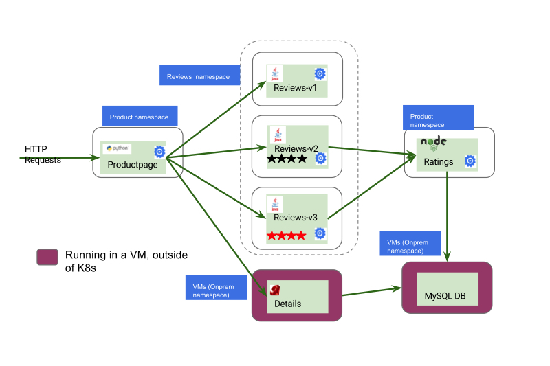

# 集成虚拟机

**注意：本文档已失效，请浏览 [Istio 官方文档](https://istio.io/zh)。本书中的 Service Mesh 章节已不再维护，请转到 [istio-handbook](https://jimmysong.io/istio-handbook) 中浏览。**

该示例跨越 Kubernetes 集群和一组虚拟机上部署 Bookinfo 服务，描述如何使用 Istio service mesh 将此基础架构以单一 mesh 的方式操控。

> 注意：本文档还在建设中，并且只在 Google Cloud Platform 上进行过测试。
> 在 IBM Bluemix 或其它平台上，pod 的 overlay 网络跟虚拟机的网络是隔离的。
> 即使使用 Istio，虚拟机也不能直接与 Kubernetes Pod 进行通信。

## 概览



## 开始之前

- 按照 [安装指南](https://istio.io/zh/docs/setup/kubernetes/) 上的步骤部署 Istio。
- 部署 [BookInfo](https://istio.io/zh/docs/examples/bookinfo/) 示例应用程序（在 `bookinfo` namespace 下）。
- 在 Istio 集群相同的项目下创建名为 `vm-1` 的虚拟机，并 [加入到 Mesh](https://istio.io/zh/docs/setup/kubernetes/mesh-expansion/)。

## 在虚拟机上运行 mysql

我们将首先在虚拟机上安装 mysql，将其配置成评分服务的后台存储。

在虚拟机上执行：

```bash
sudo apt-get update && sudo apt-get install -y mariadb-server
sudo mysql
# 授权 root 用户访问
GRANT ALL PRIVILEGES ON *.* TO 'root'@'localhost' IDENTIFIED BY 'password' WITH GRANT OPTION;
quit;
sudo systemctl restart mysql
```

关于 Mysql 的详细配置请见： [Mysql](https://mariadb.com/kb/en/library/download/)。

在虚拟机上执行下面的命令，向 mysql 中添加评分数据库。

```bash
# 向 mysql 数据库中添加评分数据库
curl -q https://raw.githubusercontent.com/istio/istio/master/samples/bookinfo/src/mysql/mysqldb-init.sql | mysql -u root -ppassword
```

为了便于直观地查看bookinfo应用程序输出的差异，可以更改使用以下命令生成的评分：

```bash
 # 查看评分
 mysql -u root -ppassword test -e "select * from ratings;"
 +----------+--------+
 | ReviewID | Rating |
 +----------+--------+
 |        1 |      5 |
 |        2 |      4 |
 +----------+--------+
 # 修改评分
 mysql -u root -ppassword test -e  "update ratings set rating=1 where reviewid=1;select * from ratings;"
+----------+--------+
| ReviewID | Rating |
+----------+--------+
|        1 |      1 |
|        2 |      4 |
+----------+--------+
```

## 找出将添加到 mesh 中的虚拟机的 IP 地址

在虚拟机上执行：

```bash
hostname -I
```

## 将 mysql 服务注册到 mesh 中

在一台可以访问 `istioctl` 命令的主机上，注册该虚拟机和 mysql db service：

```bash
istioctl register -n vm mysqldb <ip-address-of-vm> 3306
# 示例输出
$ istioctl register mysqldb 192.168.56.112 3306
I1015 22:24:33.846492   15465 register.go:44] Registering for service 'mysqldb' ip '192.168.56.112', ports list [{3306 mysql}]
I1015 22:24:33.846550   15465 register.go:49] 0 labels ([]) and 1 annotations ([alpha.istio.io/kubernetes-serviceaccounts=default])
W1015 22:24:33.866410   15465 register.go:123] Got 'services "mysqldb" not found' looking up svc 'mysqldb' in namespace 'default', attempting to create it
W1015 22:24:33.904162   15465 register.go:139] Got 'endpoints "mysqldb" not found' looking up endpoints for 'mysqldb' in namespace 'default', attempting to create them
I1015 22:24:33.910707   15465 register.go:180] No pre existing exact matching ports list found, created new subset {[{192.168.56.112  <nil> nil}] [] [{mysql 3306 }]}
I1015 22:24:33.921195   15465 register.go:191] Successfully updated mysqldb, now with 1 endpoints
```

### 集群管理

如果你之前在 kubernetes 上运行过 mysql，您需要将 kubernetes 的 mysql service 移除：

```bash
kubectl delete service mysql
```

执行 istioctl 来配置 service（在您的 admin 机器上）：

```bash
istioctl register mysql IP mysql:PORT
```

注意：`mysqldb` 虚拟机不需要也不应该有特别的 kubernetes 权限。

## 使用 mysql 服务

bookinfo 中的评分服务将使用机器上的数据库。要验证它是否有效，请创建使用虚拟机上的 mysql db 的评分服务的 v2 版本。然后指定强制评论服务使用评分 v2 版本的路由规则。

```bash
# 创建使用 mysql 后端的评分服务版本
istioctl kube-inject -n bookinfo -f samples/bookinfo/kube/bookinfo-ratings-v2-mysql-vm.yaml | kubectl apply -n bookinfo -f -

# 强制 bookinfo 使用评分后端的路有规则
istioctl create -n bookinfo -f samples/bookinfo/kube/route-rule-ratings-mysql-vm.yaml
```

您可以验证 bookinfo 应用程序的输出结果，显示来自 Reviewer1 的 1 星级和来自 Reviewer2 的 4 星级，或者更改虚拟机上的评分并查看结果。

同时，您还可以在 [RawVM MySQL](https://github.com/istio/istio/blob/master/samples/rawvm/README.md)  的文档中找到一些故障排查和其它信息。