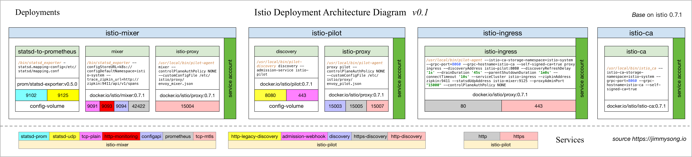
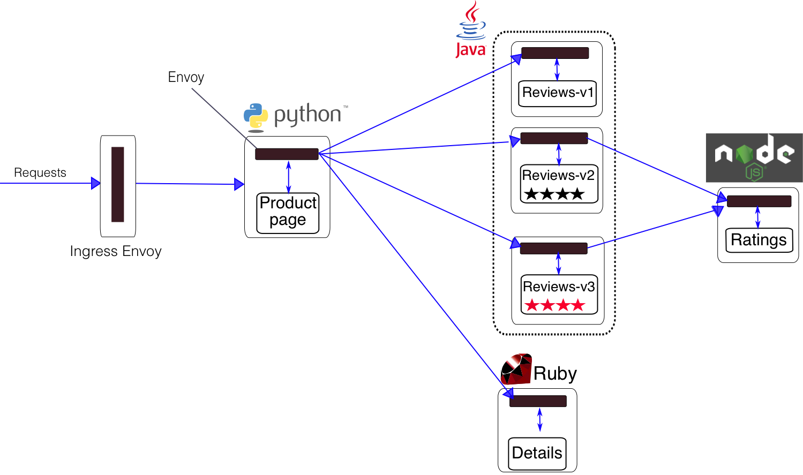
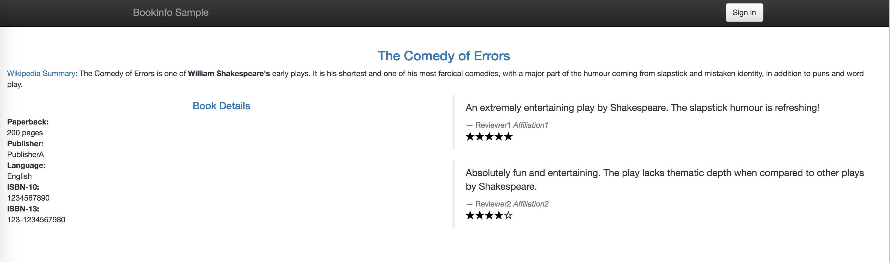
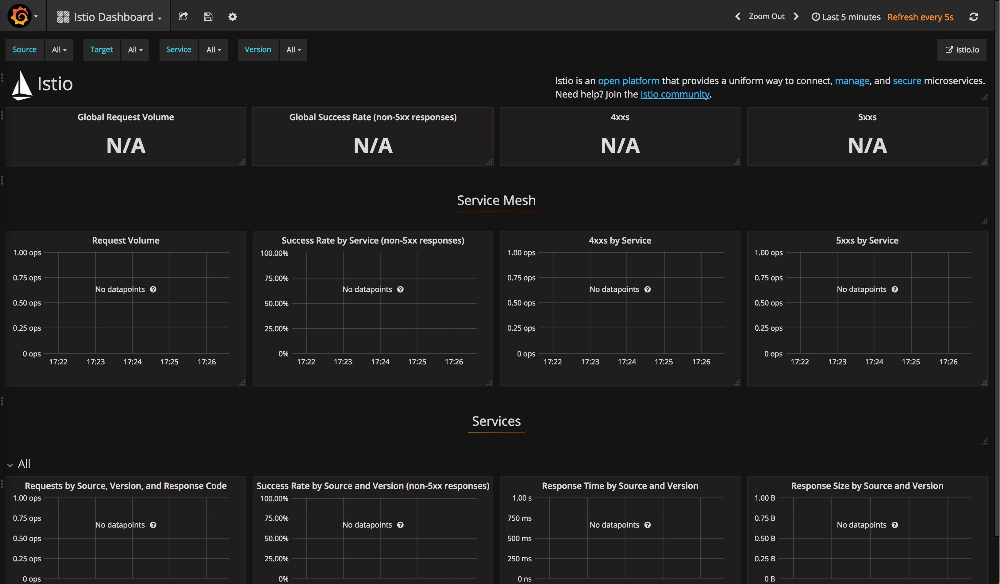
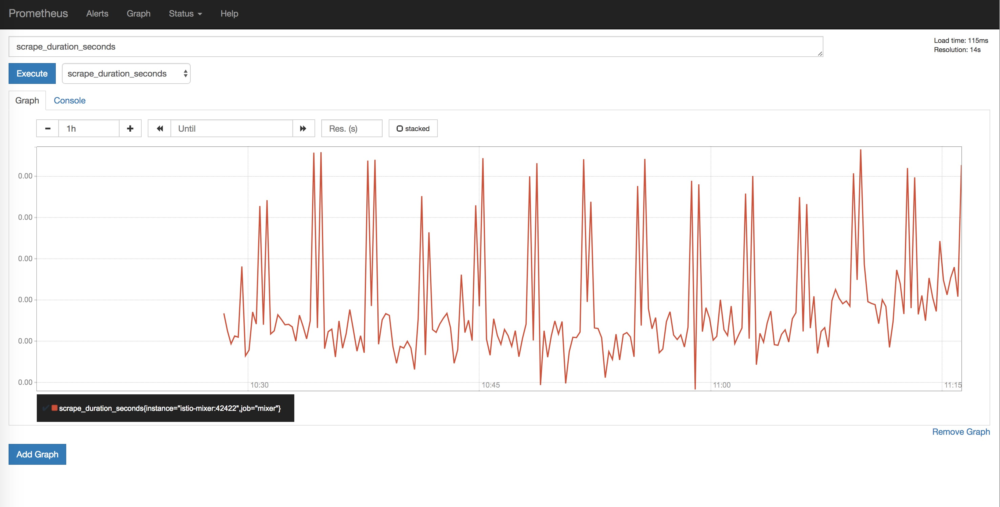
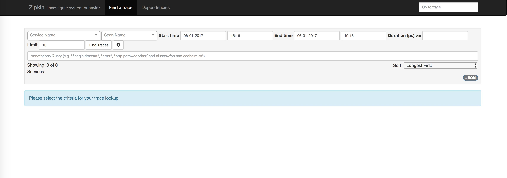
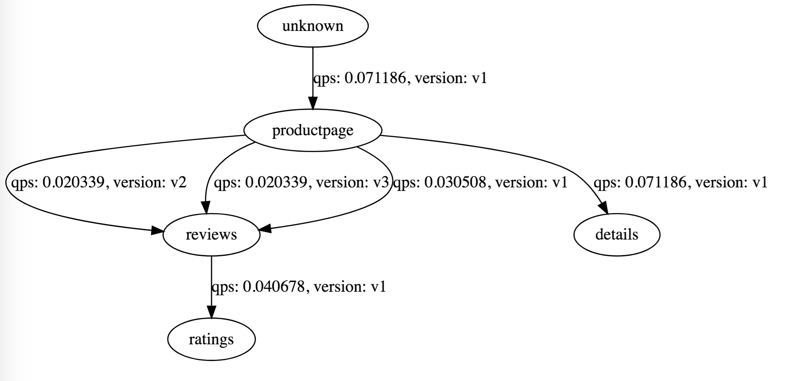

# 安装并试用Istio service mesh

**注意：本文档已失效，请浏览 [Istio 官方文档](https://istio.io/zh)。本书中的 Service Mesh 章节已不再维护，请转到 [istio-handbook](https://jimmysong.io/istio-handbook) 中浏览。**

官方文档地址 [快速开始](https://istio.io/docs/setup/kubernetes/)

本文根据官网的文档整理而成，步骤包括安装**istio 0.5.1**并创建一个bookinfo的微服务来测试istio的功能。

文中使用的yaml文件可以在[kubernetes-handbook](https://github.com/rootsongjc/kubernetes-handbook)的`manifests/istio`目录中找到，如果镜像pull失败，请根据官网的镜像自行修改。

## 安装环境

- CentOS 7.4.1708
- Docker 17.12.0-ce
- Kubernetes 1.8.5

## 部署结构

Istio 的控制平面部署在 Kubernetes 中的部署架构如下图所示。



我们可以清楚的看到 Istio 控制平面的几个组件的部署运行的命令与开发的端口，以及端口与服务之间的映射的关系。

## 安装

**1.下载安装包**

下载地址：https://github.com/istio/istio/releases

下载Linux版本的当前最新版安装包

```bash
wget https://github.com/istio/istio/releases/download/0.5.1/istio-0.5.1-linux.tar.gz
```

**2.解压**

解压后，得到的目录结构如下：

```bash
├── bin
│   └── istioctl
├── install
│   ├── ansible
│   ├── consul
│   ├── eureka
│   ├── gcp
│   ├── kubernetes
│   ├── README.md
│   └── tools
├── istio.VERSION
├── LICENSE
├── README.md
├── samples
│   ├── bookinfo
│   ├── CONFIG-MIGRATION.md
│   ├── helloworld
│   ├── httpbin
│   ├── kubernetes-blog
│   ├── rawvm
│   ├── README.md
│   └── sleep
└── tools
    ├── cache_buster.yaml
    ├── deb
    ├── githubContrib
    ├── minikube.md
    ├── perf_istio_rules.yaml
    ├── perf_k8svcs.yaml
    ├── README.md
    ├── rules.yml
    ├── setup_perf_cluster.sh
    ├── setup_run
    ├── update_all
    └── vagrant
```

从文件里表中可以看到，安装包中包括了kubernetes的yaml文件，示例应用和安装模板。

**3.先决条件**

以下说明要求您可以访问启用了RBAC（基于角色的访问控制）的Kubernetes1.7.3或更新的群集。您还需要安装1.7.3或更高版本。如果您希望启用automatic sidecar injection，则需要Kubernetes 1.9或更高版本。kubectl

注意：如果您安装了Istio 0.1.x，请在安装新版本之前彻底卸载它（包括适用于所有启用Istio的应用程序窗口的Istio支架）。
安装或升级Kubernetes CLIkubectl以匹配群集支持的版本（CRD支持版本为1.7或更高版本）。

根据您的Kubernetes提供者：

要在本地安装Istio，请安装最新版本的Minikube（版本0.22.1或更高版本）。

**4.安装步骤**

从0.2版本开始，Istio安装在它自己的istio-system命名空间中，并且可以管理来自所有其他命名空间的服务。

转至Istio发布页面以下载与您的操作系统相对应的安装文件。如果您使用的是MacOS或Linux系统，以下命令自动下载并提取最新版本：

```bash 
curl -L https://git.io/getLatestIstio | sh -
```

解压缩安装文件并将目录更改为文件位置。

*安装目录包含*：

    Installation .yaml Kubernetes的安装文件
    Sample/ 示例应用程序
    bin/istioctl 二进制bin/文件 在手动注入Envoy作为附属代理并创建路由规则和策略时使用.
    istio.VERSION配置文件
例如，如果包是istio-0.5（初步）

```bash 
cd istio-0.5 (preliminary)
```
将istioctl客户端添加到您的PATH。例如，在MacOS或Linux系统上运行以下命令：

```bash
export PATH=$PWD/bin:$PATH
```

安装Istio的核心组件。从下面两个互相排斥的选项中选择一个，或者用Helm Chart交替安装：
a）安装Istio而不启用侧车间的相互TLS认证。为具有现有应用程序的群集，使用Istio辅助车的服务需要能够与其他非Istio Kubernetes服务以及使用活动性和准备就绪探测器，无头服务或StatefulSets的应用程序通信的应用程序选择此选项。

```bash 
kubectl apply -f install/kubernetes/istio.yaml
```

**要么**

b）安装Istio并启用侧柜之间的相互TLS认证：

```bash 
kubectl apply -f install/kubernetes/istio-auth.yaml
```

这两个选项都会创建istio-system命名空间以及所需的RBAC权限，并部署Istio-Pilot，Istio-Mixer，Istio-Ingress和Istio-CA（证书颁发机构）。

可选：如果您的群集的Kubernetes版本是1.9或更高，并且您希望启用自动代理注入，请安装sidecar injector webhook。
验证安装
请确保以下Kubernetes服务部署：istio-pilot，istio-mixer，istio-ingress。

```bash 
kubectl get svc -n istio-system
```

```bash 
NAME            CLUSTER-IP      EXTERNAL-IP       PORT(S)                       AGE
istio-ingress   10.83.245.171   35.184.245.62     80:32730/TCP,443:30574/TCP    5h
istio-pilot     10.83.251.173   <none>            8080/TCP,8081/TCP             5h
istio-mixer     10.83.244.253   <none>            9091/TCP,9094/TCP,42422/TCP   5h
```

> **注意**：如果您的集群中不支持外部负载平衡（例如，Minikube）的环境中运行，该external-ip的istio-ingress会显示<pending>。您必须使用NodePort访问应用程序，或使用端口转发。

修改istio.yaml中的istio-ingress service的type为ClusterIP，并设置`nodePort`，默认为32000。

确保相应Kubernetes容器都运行起来：`istio-pilot-*`、`istio-mixer-*`、`istio-ingress-*`、`istio-ca-*`，和可选的`istio-sidecar-injector-*`。

```bash 
kubectl get pods -n istio-system
```
```bash 
istio-ca-3657790228-j21b9                1/1       Running   0          5h
istio-ingress-1842462111-j3vcs           1/1       Running   0          5h
istio-sidecar-injector-184129454-zdgf5   1/1       Running   0          5h
istio-pilot-2275554717-93c43             1/1       Running   0          5h
istio-mixer-2104784889-20rm8             2/2       Running   0          5h
```
**部署您的应用程序**

您现在可以部署您自己的应用程序或者像Bookinfo一样随安装提供的示例应用程序之一。注意：应用程序必须对所有HTTP通信使用HTTP/1.1或HTTP/2.0协议，因为HTTP/1.0不受支持。

如果您启动了Istio-sidecar-injector，如上所示，您可以直接使用应用程序部署应用程序kubectl create。

Istio Sidecar注入器会自动将Envoy容器注入到您的应用程序窗格中，假设运行在标有名称空间的名称空间中`istio-injection=enabled`

```bash 
kubectl label namespace <namespace> istio-injection=enabled
```

```bash
kubectl create -n <namspace> -f <your-app-spec>.yaml
```

如果您没有安装Istio-sidecar-injector，则在部署它们之前，必须使用istioctl kube-inject将Envoy容器手动注入应用程序窗格中：

```bash 
kubectl create -f <(istioctl kube-inject -f <your-app-spec>.yaml)
```

**卸载** 

卸载Istio sidecar进样器：

如果您启用Istio-sidecar-injector，请将其卸载：

```bash
kubectl delete -f install/kubernetes/istio-sidecar-injector-with-ca-bundle.yaml
```

卸载Istio核心组件。对于0.6（初始）发行版，卸载将删除RBAC权限，istio-system命名空间和分层下的所有资源。忽略不存在资源的错误是安全的，因为它们可能已被分层删除。

a）如果您在禁用相互TLS身份验证的情况下安装了Istio：

```bash 
kubectl delete -f install/kubernetes/istio.yaml
```

要么

b）如果您在启用相互TLS身份验证的情况下安装了Istio：

```bash 
kubectl delete -f install/kubernetes/istio-auth.yaml
```

**7.安装监控插件**


安装插件

```bash
kubectl apply -f install/kubernetes/addons/prometheus.yaml
kubectl apply -f install/kubernetes/addons/grafana.yaml
kubectl apply -f install/kubernetes/addons/servicegraph.yaml
kubectl apply -f install/kubernetes/addons/zipkin.yaml
```

在traefik ingress中增加增加以上几个服务的配置，同时增加istio-ingress配置。

```yaml
    - host: grafana.istio.io
      http:
        paths:
        - path: /
          backend:
            serviceName: grafana
            servicePort: 3000
    - host: servicegraph.istio.io
      http:
        paths:
        - path: /
          backend:
            serviceName: servicegraph
            servicePort: 8088
    - host: prometheus.istio.io
      http:
        paths:
        - path: /
          backend:
            serviceName: prometheus
            servicePort: 9090
    - host: zipkin.istio.io
      http:
        paths:
        - path: /
          backend:
            serviceName: zipkin
            servicePort: 9411
    - host: ingress.istio.io
      http:
        paths:
        - path: /
          backend:
            serviceName: istio-ingress
            servicePort: 80
```

## 测试

我们使用Istio提供的测试应用[bookinfo](https://istio.io/docs/samples/bookinfo.html)微服务来进行测试。

该微服务用到的镜像有：

```
istio/examples-bookinfo-details-v1
istio/examples-bookinfo-ratings-v1
istio/examples-bookinfo-reviews-v1
istio/examples-bookinfo-reviews-v2
istio/examples-bookinfo-reviews-v3
istio/examples-bookinfo-productpage-v1
```

该应用架构图如下：



**部署应用**

```
kubectl create -f <(istioctl kube-inject -f samples/apps/bookinfo/bookinfo.yaml)
```

`Istio kube-inject`命令会在`bookinfo.yaml`文件中增加Envoy sidecar信息。参考 https://istio.io/docs/reference/commands/istioctl/#istioctl-kube-inject

在本机的`/etc/hosts`下增加VIP节点和`ingress.istio.io`的对应信息，具体步骤参考：[边缘节点配置](../practice/edge-node-configuration.md)，或者使用gateway ingress来访问服务，

如果将`productpage`配置在了ingress里了，那么在浏览器中访问`http://ingress.istio.io/productpage`，如果使用了istio默认的`gateway` ingress配置的话，ingress service使用`nodePort`方式暴露的默认使用32000端口，那么可以使用 `http://任意节点的IP:32000/productpage` 来访问。



多次刷新页面，你会发现有的页面上的评论里有星级打分，有的页面就没有，这是因为我们部署了三个版本的应用，有的应用里包含了评分，有的没有。Istio根据默认策略随机将流量分配到三个版本的应用上。

查看部署的bookinfo应用中的`productpage-v1` service和deployment，查看`productpage-v1`的pod的详细json信息可以看到这样的结构：

```bash
$ kubectl get pod productpage-v1-944450470-bd530 -o json
```

见[productpage-v1-istio.json](../manifests/istio/productpage-v1-istio.json)文件。从详细输出中可以看到这个Pod中实际有两个容器，这里面包括了`initContainer`，作为istio植入到kubernetes deployment中的sidecar。

```json
"initContainers": [
            {
                "args": [
                    "-p",
                    "15001",
                    "-u",
                    "1337"
                ],
                "image": "docker.io/istio/init:0.1",
                "imagePullPolicy": "Always",
                "name": "init",
                "resources": {},
                "securityContext": {
                    "capabilities": {
                        "add": [
                            "NET_ADMIN"
                        ]
                    }
                },
                "terminationMessagePath": "/dev/termination-log",
                "terminationMessagePolicy": "File",
                "volumeMounts": [
                    {
                        "mountPath": "/var/run/secrets/kubernetes.io/serviceaccount",
                        "name": "default-token-3l9f0",
                        "readOnly": true
                    }
                ]
            },
            {
                "args": [
                    "-c",
                    "sysctl -w kernel.core_pattern=/tmp/core.%e.%p.%t \u0026\u0026 ulimit -c unlimited"
                ],
                "command": [
                    "/bin/sh"
                ],
                "image": "alpine",
                "imagePullPolicy": "Always",
                "name": "enable-core-dump",
                "resources": {},
                "securityContext": {
                    "privileged": true
                },
                "terminationMessagePath": "/dev/termination-log",
                "terminationMessagePolicy": "File",
                "volumeMounts": [
                    {
                        "mountPath": "/var/run/secrets/kubernetes.io/serviceaccount",
                        "name": "default-token-3l9f0",
                        "readOnly": true
                    }
                ]
            }
        ],
```

## 监控

不断刷新productpage页面，将可以在以下几个监控中看到如下界面。

**Grafana页面**

`http://grafana.istio.io`



**Prometheus页面**

`http://prometheus.istio.io`



**Zipkin页面**

`http://zipkin.istio.io`



**ServiceGraph页面**

`http://servicegraph.istio.io/dotviz`

可以用来查看服务间的依赖关系。

访问` http://servicegraph.istio.io/graph` 可以获得json格式的返回结果。



## 更进一步

BookInfo示例中有三个版本的`reviews`，可以使用istio来配置路由请求，将流量分发到不同版本的应用上。参考[Configuring Request Routing](https://istio.io/docs/tasks/request-routing.html)。

还有一些更高级的功能，我们后续将进一步探索。

## 参考

- [安装 Istio](https://istio.io/zh/docs/setup/kubernetes/)
- [BookInfo 应用](https://istio.io/zh/docs/examples/bookinfo/)