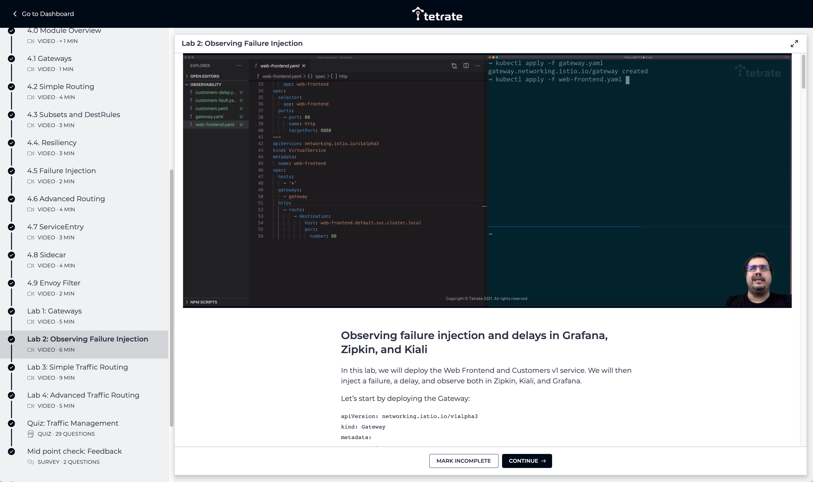
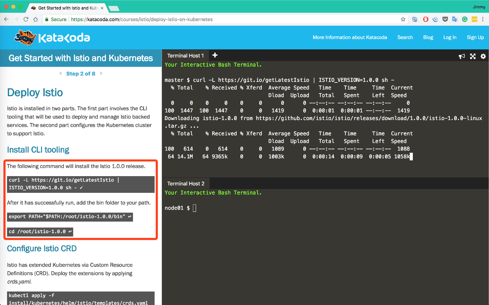
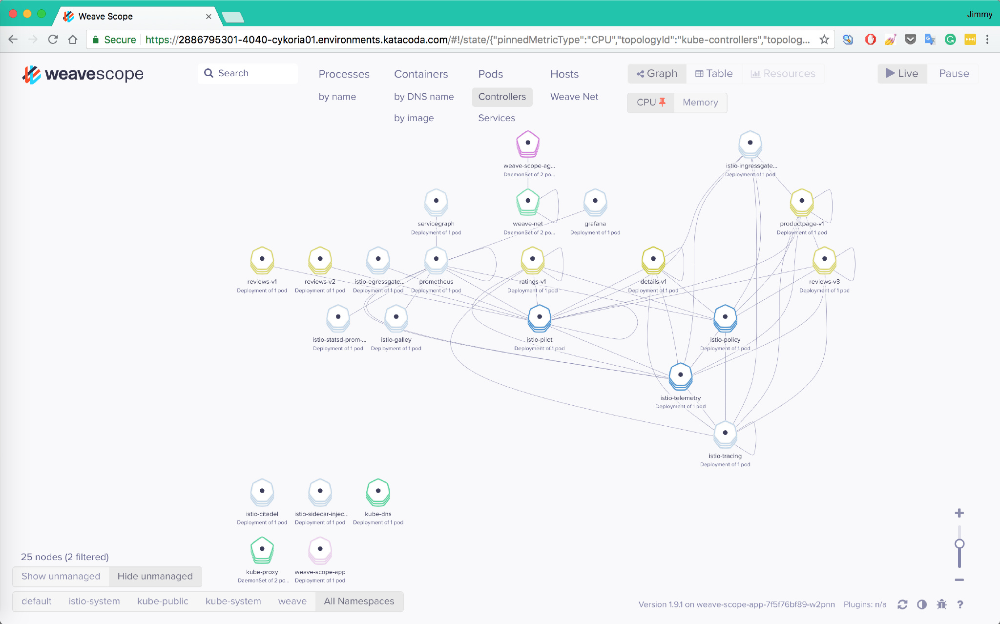
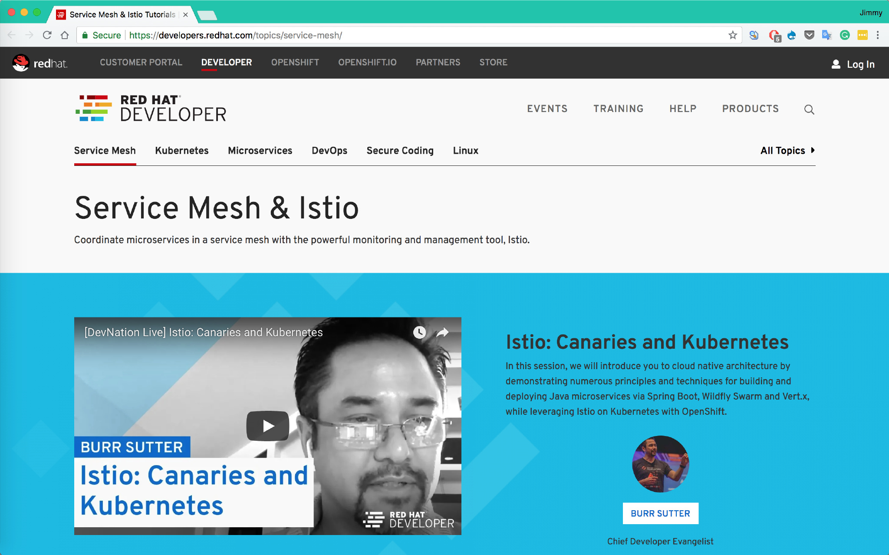
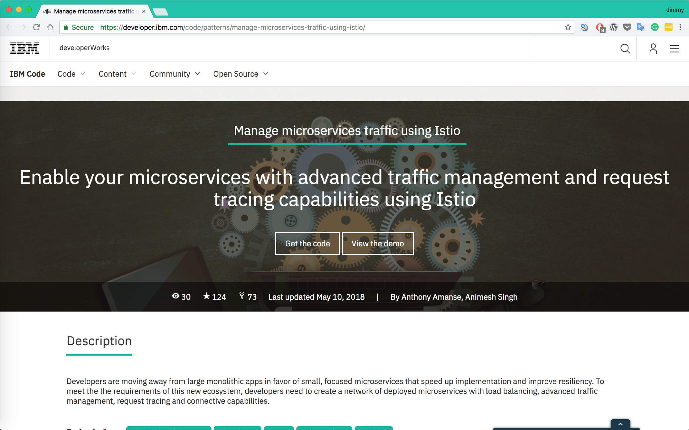
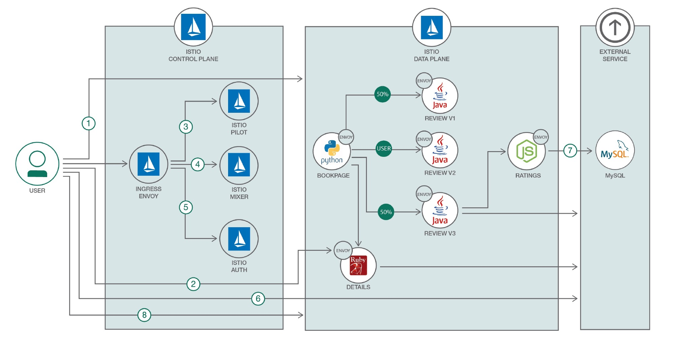

# Istio 学习资源汇总

在本地搭建起来还是有些门槛，稍显复杂，本文中将向你推荐几个可以在线上学习 Istio 的地方。

## Tetrate 提供的 Istio 基础课程

推荐指数：⭑⭑⭑⭑⭑

推荐原因：Tetrate 是企业级服务网格提供商，是 Istio 的核心贡献者之一，Tetrate 提供的免费的 Istio 基础课程，其中包括文字加视频讲解，覆盖全面，课后还有自主测试，内容最新最完整。

地址：https://academy.tetrate.io/courses/istio-fundamentals

## Katacode上的Istio学习环境

推荐指数：⭑⭑⭑⭑

推荐原因：使用简单，使用官方示例，免费，快速，无需注册，可直接通过互联网访问示例应用页面，支持最新版的Istio。

Katacoda已支持Istio的学习环境。

地址：https://www.katacoda.com/courses/istio/deploy-istio-on-kubernetes

只要傻瓜式操作就可以部署一个Istio出来，同时还提供了Weave scope可以对service mesh的中的服务关系做可视化呈现。

同时还能提供部分监控功能，比如服务状态，CPU和内存使用情况。

## Red Hat提供的Istio教程

推荐指数：⭑⭑⭑⭑

推荐原因：教程topic划分简洁得当，RedHat大力加持，未来的频繁更新可以预期。

## IBM的Istio示例教程

推荐指数：⭑⭑⭑

推荐原因：IBM作为Istio项目的联合创始公司，在Istio中也有大量的投入，未来可能会有更多的示例放出。

https://developer.ibm.com/code/patterns/manage-microservices-traffic-using-istio

GitHub地址：https://github.com/IBM/microservices-traffic-management-using-istio/

## Istio Handbook

推荐指数：⭑⭑⭑⭑⭑

推荐原因：由 ServiceMesher 共同撰写的开源 Istio 电子书，作为国内最早最大最专业的服务网格社区，这本书是社区共同经验的结晶。阅读地址 https://www.servicemesher.com/istio-handbook/