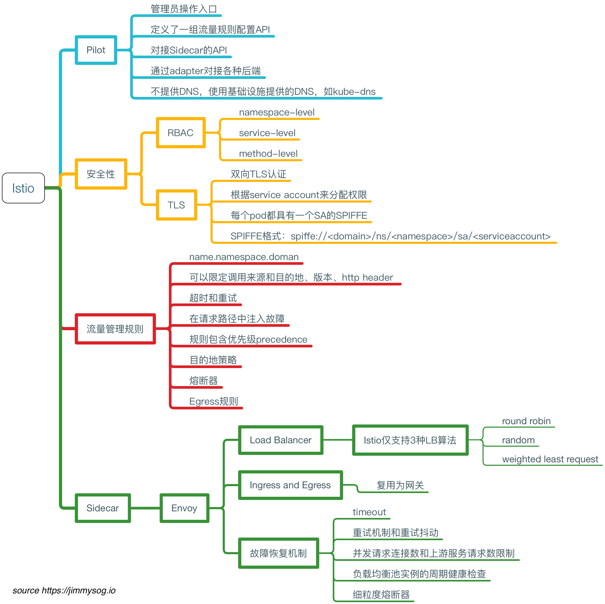
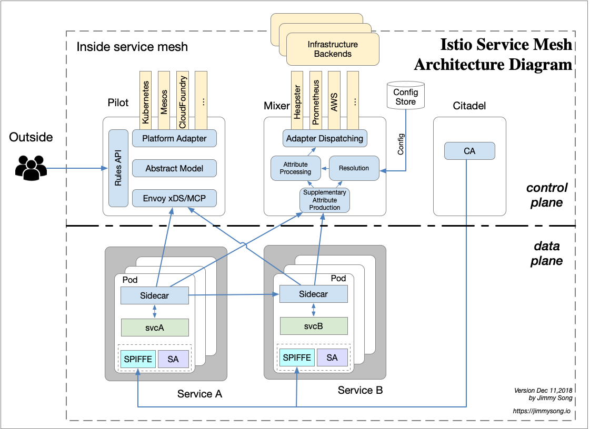

# Istio简介

**注意：Istio 1.10于2018年8月1日发布1.0，关于Istio的更多信息请见Istio官方文档:<https://istio.io>，中文版：<https://istio.io/zh>，本书中的 Service Mesh 章节已不再维护，请转到 [istio-handbook](https://jimmysong.io/istio-handbook) 中浏览。**

[Istio](https://istio.io)是由Google、IBM和Lyft开源的微服务管理、保护和监控框架。Istio为希腊语，意思是”起航“。

**TL;DR** 关于Istio中的各个组件和一些关键信息请参考下面的mindmap。

## 简介

使用istio可以很简单的创建具有负载均衡、服务间认证、监控等功能的服务网络，而不需要对服务的代码进行任何修改。你只需要在部署环境中，例如Kubernetes的pod里注入一个特别的sidecar proxy来增加对istio的支持，用来截获微服务之间的网络流量。

目前版本的istio只支持kubernetes，未来计划支持其他其他环境。

另外，Istio的前身是IBM开源的[Amalgam8](https://www.amalgam8.io)，追本溯源，我们来看下它的特性。

### Amalgam8

Amalgam8的网站上说，它是一个**Content-based Routing Fabric for Polyglot Microservices**，简单、强大且开源。

Amalgam8是一款基于内容和版本的路由布局，用于集成多语言异构体微服务。 其control plane API可用于动态编程规则，用于在正在运行的应用程序中跨微服务进行路由和操作请求。

以内容/版本感知方式路由请求的能力简化了DevOps任务，如金丝雀和红/黑发布，A/B Test和系统地测试弹性微服务。

可以使用Amalgam8平台与受欢迎的容器运行时（如Docker，Kubernetes，Marathon / Mesos）或其他云计算提供商（如IBM Bluemix，Google Cloud Platform或Amazon AWS）。

## 特性

使用istio的进行微服务管理有如下特性：

- **流量管理**：控制服务间的流量和API调用流，使调用更可靠，增强不同环境下的网络鲁棒性。
- **可观测性**：了解服务之间的依赖关系和它们之间的性质和流量，提供快速识别定位问题的能力。
- **策略实施**：通过配置mesh而不是以改变代码的方式来控制服务之间的访问策略。
- **服务识别和安全**：提供在mesh里的服务可识别性和安全性保护。

未来将支持多种平台，不论是kubernetes、Mesos、还是云。同时可以集成已有的ACL、日志、监控、配额、审计等。

## 架构

下面是Istio的架构图。

Istio架构分为控制平面和数据平面。

- **数据平面**：由一组智能代理（Envoy）作为sidecar部署，协调和控制所有microservices之间的网络通信。
- **控制平面**：负责管理和配置代理路由流量，以及在运行时执行的政策。

## Envoy

Istio使用Envoy代理的扩展版本，该代理是以C++开发的高性能代理，用于调解service mesh中所有服务的所有入站和出站流量。 Istio利用了Envoy的许多内置功能，例如动态服务发现，负载平衡，TLS终止，HTTP/2＆gRPC代理，断路器，运行状况检查，基于百分比的流量拆分分阶段上线，故障注入和丰富指标。

Envoy在kubernetes中作为pod的sidecar来部署。 这允许Istio将大量关于流量行为的信号作为属性提取出来，这些属性又可以在Mixer中用于执行策略决策，并发送给监控系统以提供有关整个mesh的行为的信息。 Sidecar代理模型还允许你将Istio功能添加到现有部署中，无需重新构建或重写代码。 更多信息参见[设计目标](https://istio.io/docs/concepts/what-is-istio/goals.html)。

## Mixer

Mixer负责在service mesh上执行访问控制和使用策略，并收集Envoy代理和其他服务的遥测数据。代理提取请求级属性，发送到mixer进行评估。有关此属性提取和策略评估的更多信息，请参见[Mixer配置](https://istio.io/docs/concepts/policy-and-control/mixer-config.html)。 混音器包括一个灵活的插件模型，使其能够与各种主机环境和基础架构后端进行接口，从这些细节中抽象出Envoy代理和Istio管理的服务。

## Istio Manager

Istio-Manager用作用户和Istio之间的接口，收集和验证配置，并将其传播到各种Istio组件。它从Mixer和Envoy中抽取环境特定的实现细节，为他们提供独立于底层平台的用户服务的抽象表示。 此外，流量管理规则（即通用4层规则和七层HTTP/gRPC路由规则）可以在运行时通过Istio-Manager进行编程。

## Istio-auth

Istio-Auth提供强大的服务间和最终用户认证，使用相互TLS，内置身份和凭据管理。它可用于升级service mesh中的未加密流量，并为运营商提供基于服务身份而不是网络控制的策略的能力。 Istio的未来版本将增加细粒度的访问控制和审计，以使用各种访问控制机制（包括属性和基于角色的访问控制以及授权hook）来控制和监控访问你服务、API或资源的人员。

## 参考

- [Istio：用于微服务的服务啮合层](http://www.infoq.com/cn/news/2017/05/istio?utm_source=news_about_opensource&utm_medium=link&utm_campaign=opensource)
- [Istio 是什么？](https://istio.io/zh/docs/concepts/what-is-istio/)