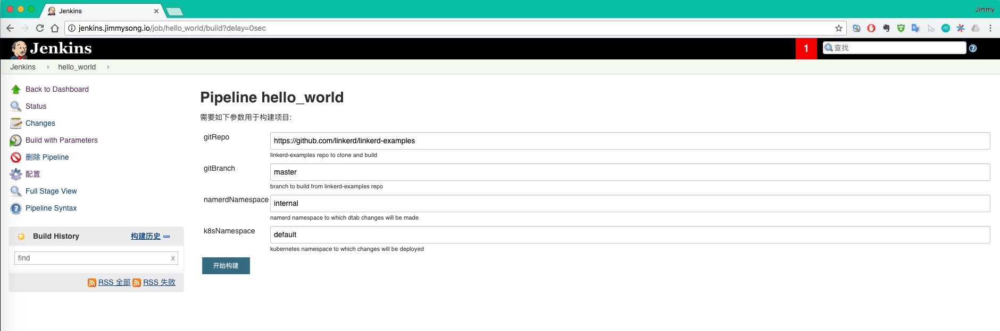
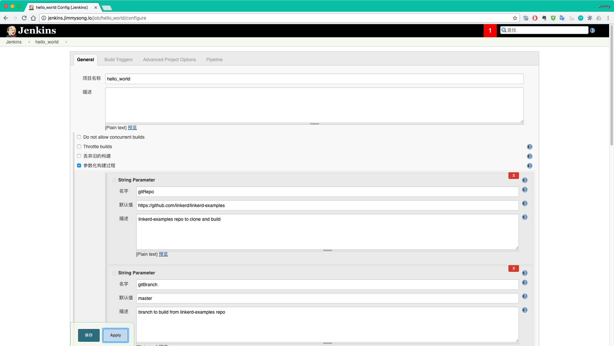
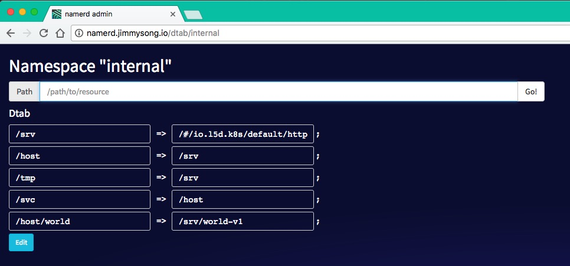
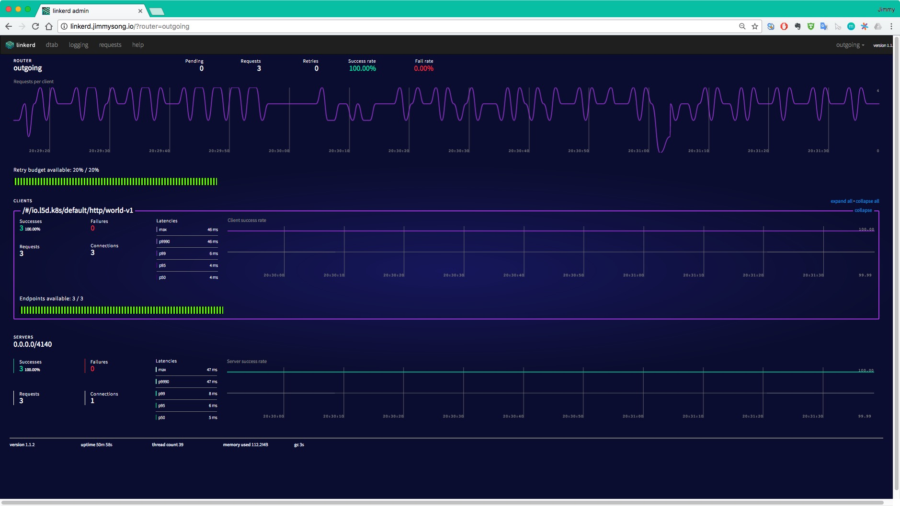
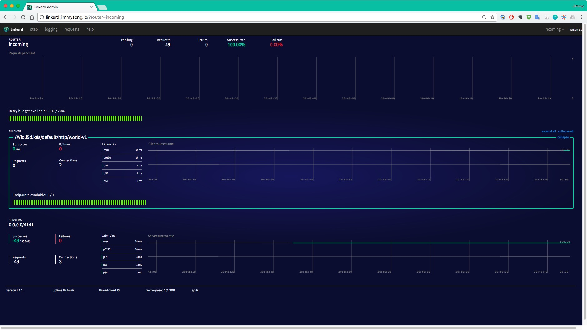
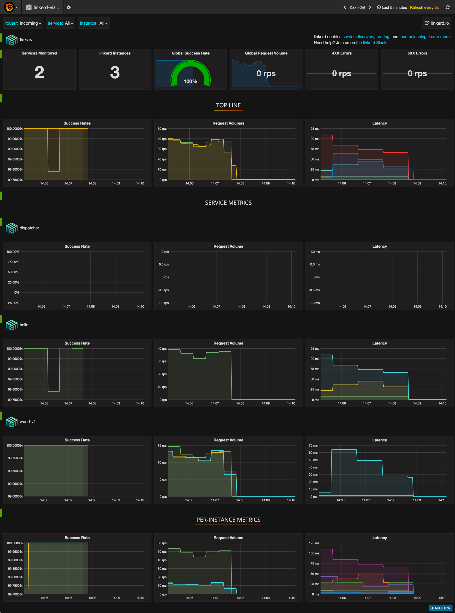
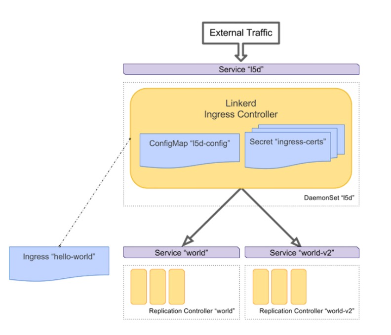

# Linkerd 使用指南

本文是 Linkerd 使用指南，我们着重讲解在 kubernetes 中如何使用 linkerd 作为 kubernetes 的 Ingress controller。

## 前言

Linkerd 作为一款 service mesh 与kubernetes 结合后主要有以下几种用法：

1. 作为服务网关，可以监控 kubernetes 中的服务和实例
2. 使用 TLS 加密服务
3. 通过流量转移到持续交付
4. 开发测试环境（Eat your own dog food）、Ingress 和边缘路由
5. 给微服务做 staging
6. 分布式 tracing
7. 作为 Ingress controller
8. 使用 gRPC 更方便

以下我们着重讲解在 kubernetes 中如何使用 linkerd 作为 kubernetes 的 Ingress controller，并作为边缘节点代替 [Traefik](https://traefik.io) 的功能，详见 [边缘节点的配置](../practice/edge-node-configuration.md)。

## 准备

安装测试时需要用到的镜像有：

```ini
buoyantio/helloworld:0.1.4
buoyantio/jenkins-plus:2.60.1
buoyantio/kubectl:v1.4.0
buoyantio/linkerd:1.1.2
buoyantio/namerd:1.1.2
buoyantio/nginx:1.10.2
linkerd/namerctl:0.8.6
openzipkin/zipkin:1.20
tutum/dnsutils:latest
```

这些镜像可以直接通过 Docker Hub 获取，我将它们下载下来并上传到了自己的私有镜像仓库 `harbor-001.jimmysong.io` 中，下文中用到的镜像皆来自我的私有镜像仓库，yaml 配置见 linkerd目录，并在使用时将配置中的镜像地址修改为你自己的。

## 部署

首先需要先创建 RBAC，因为使用 namerd 和 ingress 时需要用到。

```bash
$ kubectl create -f linkerd-rbac-beta.yml
```

Linkerd 提供了 Jenkins 示例，在部署的时候使用以下命令：

```bash
$ kubectl create -f jenkins-rbac-beta.yml
$ kubectl create -f jenkins.yml
```

访问 http://jenkins.jimmysong.io






**注意**：要访问 Jenkins 需要在 Ingress 中增加配置，下文会提到。

在 kubernetes 中使用 Jenkins 的时候需要注意 Pipeline 中的配置：

```python
    def currentVersion = getCurrentVersion()
    def newVersion = getNextVersion(currentVersion)
    def frontendIp = kubectl("get svc l5d -o jsonpath=\"{.status.loadBalancer.ingress[0].*}\"").trim()
    def originalDst = getDst(getDtab())
```

`frontendIP` 的地址要配置成 service 的 Cluster IP ，因为我们没有用到LoadBalancer。

需要安装 namerd，namerd 负责 dtab 信息的存储，当然也可以存储在 etcd、consul中。dtab 保存的是路由规则信息，支持递归解析，详见  [dtab](https://linkerd.io/in-depth/dtabs/)。

流量切换主要是通过 [dtab](https://linkerd.io/in-depth/dtabs/) 来实现的，通过在 HTTP 请求的 header 中增加 `l5d-dtab`  和  `Host` 信息可以对流量分离到 kubernetes 中的不同 service 上。

**遇到的问题**

Failed with the following error(s)
Error signal	dtab is already marked as being deployed!

因为该 dtab entry 已经存在，需要删除后再运行。

访问 `http://namerd.jimmysong.io`



dtab 保存在 namerd 中，该页面中的更改不会生效，需要使用命令行来操作。

使用 [namerctl](https://github.com/linkerd/namerctl) 来操作。

```bash
$ namerctl --base-url http://namerd-backend.jimmysong.io dtab update internal file
```

**注意**：update 时需要将更新文本先写入文件中。

## 部署 Linkerd

直接使用 yaml 文件部署，注意修改镜像仓库地址。

```bash
# 创建 namerd
$ kubectl create -f namerd.yaml
# 创建 ingress
$ kubectl create -f linkerd-ingress.yml
# 创建测试服务 hello-world
$ kubectl create -f hello-world.yml
# 创建 API 服务
$ kubectl create -f api.yml
# 创建测试服务 world-v2
$ kubectl create -f world-v2.yml
```

为了在本地调试 linkerd，我们将 linkerd 的 service 加入到 ingress 中，详见 [边缘节点配置](../practice/edge-node-configuration.md)。

在 Ingress 中增加如下内容：

```yaml
    - host: linkerd.jimmysong.io
      http:
        paths:
        - path: /
          backend:
            serviceName: l5d
            servicePort: 9990
    - host: linkerd-viz.jimmysong.io
      http:
        paths:
        - path: /
          backend:
            serviceName: linkerd-viz
            servicePort: 80
    - host: l5d.jimmysong.io
      http:
        paths:
        - path: /
          backend:
            serviceName: l5d
            servicePort: 4141
    - host: jenkins.jimmysong.io
      http:
        paths:
        - path: /
          backend:
            serviceName: jenkins
            servicePort: 80
```

在本地`/etc/hosts`中添加如下内容：

```ini
172.20.0.119 linkerd.jimmysong.io
172.20.0.119 linkerd-viz.jimmysong.io
172.20.0.119 l5d.jimmysong.io
```

**测试路由功能**

使用 curl 简单测试。

单条测试

```bash
$ curl -s -H "Host: www.hello.world" 172.20.0.120:4141
Hello (172.30.60.14) world (172.30.71.19)!!%  
```

请注意请求返回的结果，表示访问的是 `world-v1` service。

```bash
$ for i in $(seq 0 10000);do echo $i;curl -s -H "Host: www.hello.world" 172.20.0.120:4141;done
```

使用 ab test。

```bash
$ ab -c 4 -n 10000  -H "Host: www.hello.world" http://172.20.0.120:4141/
This is ApacheBench, Version 2.3 <$Revision: 1757674 $>
Copyright 1996 Adam Twiss, Zeus Technology Ltd, http://www.zeustech.net/
Licensed to The Apache Software Foundation, http://www.apache.org/

Benchmarking 172.20.0.120 (be patient)
Completed 1000 requests
Completed 2000 requests
Completed 3000 requests
Completed 4000 requests
Completed 5000 requests
Completed 6000 requests
Completed 7000 requests
Completed 8000 requests
Completed 9000 requests
Completed 10000 requests
Finished 10000 requests


Server Software:        
Server Hostname:        172.20.0.120
Server Port:            4141

Document Path:          /
Document Length:        43 bytes

Concurrency Level:      4
Time taken for tests:   262.505 seconds
Complete requests:      10000
Failed requests:        0
Total transferred:      2210000 bytes
HTML transferred:       430000 bytes
Requests per second:    38.09 [#/sec] (mean)
Time per request:       105.002 [ms] (mean)
Time per request:       26.250 [ms] (mean, across all concurrent requests)
Transfer rate:          8.22 [Kbytes/sec] received

Connection Times (ms)
              min  mean[+/-sd] median   max
Connect:       36   51  91.1     39    2122
Processing:    39   54  29.3     46     585
Waiting:       39   52  20.3     46     362
Total:         76  105  96.3     88    2216

Percentage of the requests served within a certain time (ms)
  50%     88
  66%     93
  75%     99
  80%    103
  90%    119
  95%    146
  98%    253
  99%    397
 100%   2216 (longest request)
```

## 监控 kubernets 中的服务与实例

访问 `http://linkerd.jimmysong.io` 查看流量情况

Outcoming 



Incoming



访问 `http://linkerd-viz.jimmysong.io` 查看应用 metric 监控



## 测试路由

测试在 http header 中增加 dtab 规则。

```bash
$ curl -H "Host: www.hello.world" -H "l5d-dtab:/host/world => /srv/world-v2;" 172.20.0.120:4141 
Hello (172.30.60.14) earth (172.30.94.40)!!
```

请注意调用返回的结果，表示调用的是 `world-v2` 的 service。

另外再对比 ab test 的结果与  `linkerd-viz ` 页面上的结果，可以看到结果一致。

但是我们可能不想把该功能暴露给所有人，所以可以在前端部署一个 nginx 来过滤 header 中的 `l5d-dtab` 打头的字段，并通过设置 cookie 的方式来替代 header 里的 `l5d-dtab` 字段。

```bash
$ http_proxy=http://172.20.0.120:4141 curl -s http:/hello
Hello (172.30.60.14) world (172.30.71.19)!!
```

## 将 Linkerd 作为 Ingress controller

将 Linkerd 作为 kubernetes ingress controller 的方式跟将 Treafik 作为 ingress controller 的过程过程完全一样，可以直接参考 [边缘节点配置](../practice/edge-node-configuration.md)。

架构如下图所示。



*(图片来自 A Service Mesh for Kubernetes - Buoyant.io)*

当然可以绕过 kubernetes ingress controller 直接使用 linkerd 作为边界路由，通过 dtab 和 linkerd 前面的 nginx 来路由流量。

## 参考

- https://github.com/linkerd/linkerd-examples
- [dtab](https://linkerd.io/in-depth/dtabs/)
