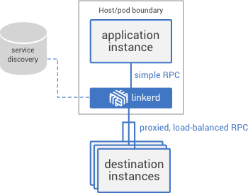

# Linkerd简介

Linkerd是一个用于云原生应用的开源、可扩展的service mesh（一般翻译成服务网格，还有一种说法叫”服务啮合层“，见[Istio：用于微服务的服务啮合层](http://www.infoq.com/cn/news/2017/05/istio)）。

## Linkerd是什么

Linkerd的出现是为了解决像twitter、google这类超大规模生产系统的复杂性问题。Linkerd不是通过控制服务之间的通信机制来解决这个问题，而是通过在服务实例之上添加一个抽象层来解决的。



Linkerd负责跨服务通信中最困难、易出错的部分，包括延迟感知、负载平衡、连接池、TLS、仪表盘、请求路由等——这些都会影响应用程序伸缩性、性能和弹性。

## 如何运行

Linkerd作为独立代理运行，无需特定的语言和库支持。应用程序通常会在已知位置运行linkerd实例，然后通过这些实例代理服务调用——即不是直接连接到目标服务，服务连接到它们对应的linkerd实例，并将它们视为目标服务。

在该层上，linkerd应用路由规则，与现有服务发现机制通信，对目标实例做负载均衡——与此同时调整通信并报告指标。 

通过延迟调用linkerd的机制，应用程序代码与以下内容解耦：

- 生产拓扑
- 服务发现机制
- 负载均衡和连接管理逻辑

应用程序也将从一致的全局流量控制系统中受益。这对于多语言应用程序尤其重要，因为通过库来实现这种一致性是非常困难的。

Linkerd实例可以作为sidecar（既为每个应用实体或每个主机部署一个实例）来运行。 由于linkerd实例是无状态和独立的，因此它们可以轻松适应现有的部署拓扑。它们可以与各种配置的应用程序代码一起部署，并且基本不需要去协调它们。

## 详解

Linkerd 的基于 Kubernetes 的 Service Mesh 部署方式是使用 Kubernetes 中的 **DaemonSet** 资源对象，如下图所示。


这样 Kubernetes 集群中的每个节点都会运行一个 Linkerd 的 Pod。

但是这样做就会有几个问题：

- 节点上的应用如何发现其所在节点上的 Linkerd 呢？
- 节点间的 Linkerd 如何路由的呢？
- Linkerd 如何将接收到的流量路由到正确的目的应用呢？
- 如何对应用的路有做细粒度的控制？

这几个问题在 Buoyant 公司的这篇博客中都有解答：[A Service Mesh for Kubernetes, Part II: Pods are great until they’re not](https://buoyant.io/2016/10/14/a-service-mesh-for-kubernetes-part-ii-pods-are-great-until-theyre-not/)，我们下面将简要的回答上述问题。

### 节点上的应用如何发现其所在节点上的 Linkerd 呢？

简而言之，是使用环境变量的方式，如在应用程序中注入环境变量 `http_proxy`：

```yaml
env:
- name: NODE_NAME
  valueFrom:
    fieldRef:
      fieldPath: spec.nodeName
- name: http_proxy
  value: $(NODE_NAME):4140
args:
- "-addr=:7777"
- "-text=Hello"
- "-target=world"
```

这要求应用程序必须支持该环境变量，为应用程序所在的 Pod 设置了一个代理，实际上对于每种不同的协议 Linkerd 都监听不同的端口。

- 4140 for HTTP
- 4240 for HTTP/2
- 4340 for gRPC

关于 Linkerd 作为 Service Mesh 的详细配置请参考 [serivcemesh.yml](https://github.com/rootsongjc/kubernetes-handbook/blob/master/manifests/linkerd/servicemesh.yml)。

### 节点间的 Linkerd 如何路由的以及 Linkerd 如何将接收到的流量路由到正确的目的应用呢？

通过 **transformer** 来确定节点间的 Linkerd 路由，参考下面的配置：

```yaml
routers:
- protocol: http
  label: outgoing
  interpreter:
    kind: default
    transformers:
    - kind: io.l5d.k8s.daemonset
      namespace: default
      port: incoming
      service: l5d
```

Router 定义 Linkerd 如何实际地处理流量。Router 监听请求并在这些请求上应用路有规则，代理这些请求到正确的目的地。Router 是与协议相关的。对于每个 Router 都需要定义一个 incoming router 和一个 outcoming router。预计该应用程序将流量发送到 outcoming router，该 outcoming router 将其代理到目标服务节点上运行的 Linkerd 的 incoming router。Incoming router 后将请求代理给目标应用程序本身。我们还定义了 HTTP 和 HTTP/2 incoming router，它们充当 Ingress controller 并基于 Ingress 资源进行路由。

### 如何对路由规则做细粒度的控制呢？

路由规则配置是在 namerd 中进行的，例如：

```ini
$ namerctl dtab get internal
# version MjgzNjk5NzI=
/srv         => /#/io.l5d.k8s/default/http ;
/host        => /srv ;
/tmp         => /srv ;
/svc         => /host ;
/host/world  => /srv/world-v1 ;
```

Namerd 中存储了很多 dtab 配置，通过这些配置来管理路有规则，实现微服务的流量管理。


如果将 Linkerd 作为*边缘节点*还可以充当 Ingress controller，如下图所示。


Linkerd 自己最令人称道的是它在每台主机上只安装一个 Pod，如果使用 Sidecar 模式会为每个应用程序示例旁都运行一个容器，这样会导致过多的资源消耗。[Squeezing blood from a stone: small-memory JVM techniques for microservice sidecars](https://buoyant.io/2016/06/17/small-memory-jvm-techniques-for-microservice-sidecars/) 这篇文章中详细说明了 Linkerd 的资源消耗与性能。

## 参考

- [A Service Mesh for Kubernetes, Part II: Pods are great until they’re not](https://buoyant.io/2016/10/14/a-service-mesh-for-kubernetes-part-ii-pods-are-great-until-theyre-not/)
- [Squeezing blood from a stone: small-memory JVM techniques for microservice sidecars](https://buoyant.io/2016/06/17/small-memory-jvm-techniques-for-microservice-sidecars/)
- [Buoyant发布服务网格Linkerd的1.0版本](http://www.infoq.com/cn/news/2017/05/buoyant-release-ver-1-of-linkerd)
- [Linkerd documentation](https://linkerd.io/documentation/)
- [Istio：用于微服务的服务啮合层](http://www.infoq.com/cn/news/2017/05/istio)