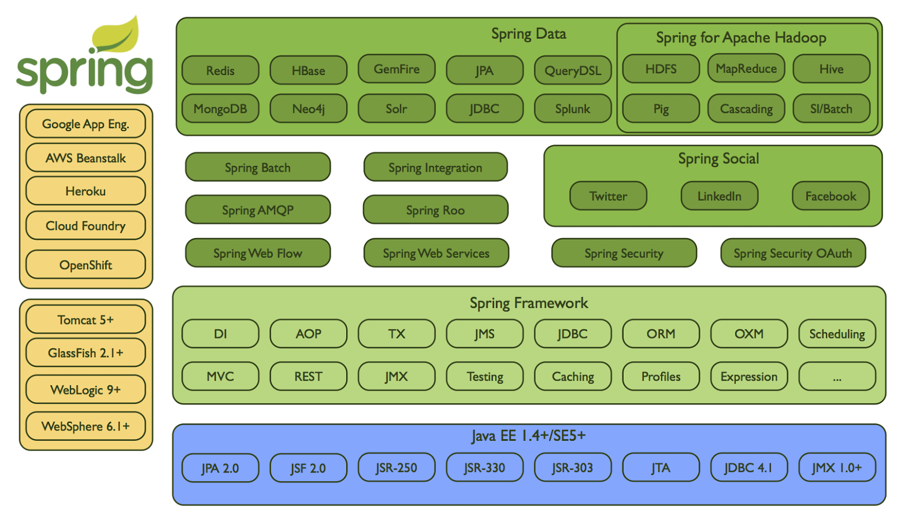
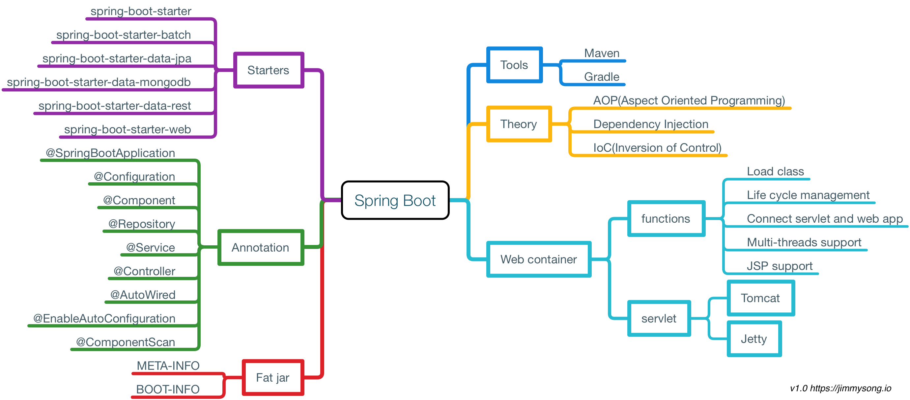

# 使用Java构建微服务并发布到Kubernetes平台

Java作为多年的编程语言届的No.1（使用人数最多，最流行），使用它来构建微服务的人也不计其数，Java的微服务框架Spring中的Spring Boot和Spring Cloud已成为当前最流行的微服务框架。

下面是Sping技术栈所包含的技术框架图。

当然如果在Kubernetes中运行Java语言构建的微服务应用，我们不会使用上图中所有的技术，本节将主要讲解如何使用Spring Boot构建微服务应用。

下图是Spring Boot的一些知识点。

Spring Boot是Spring框架的一部分，关于Spring的核心技术请参考[Spring core technologies - spring.io](https://docs.spring.io/spring/docs/current/spring-framework-reference/core.html)。
