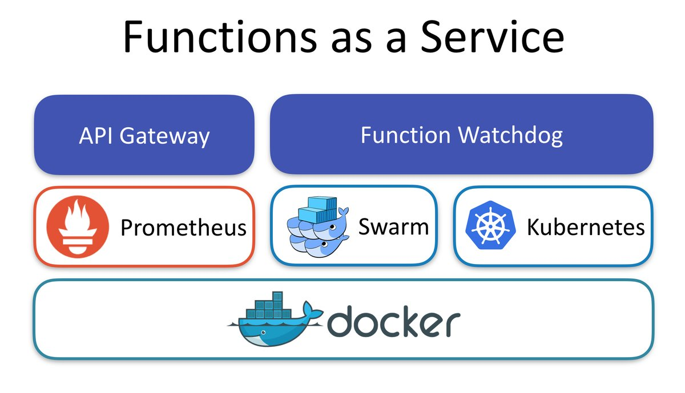
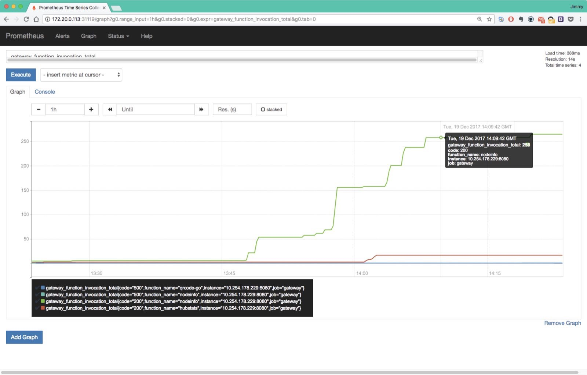
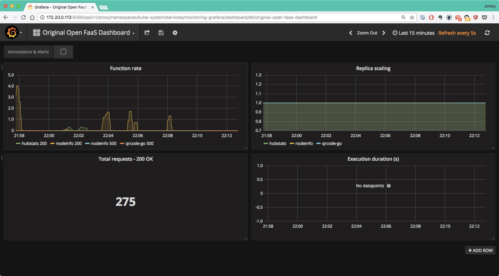
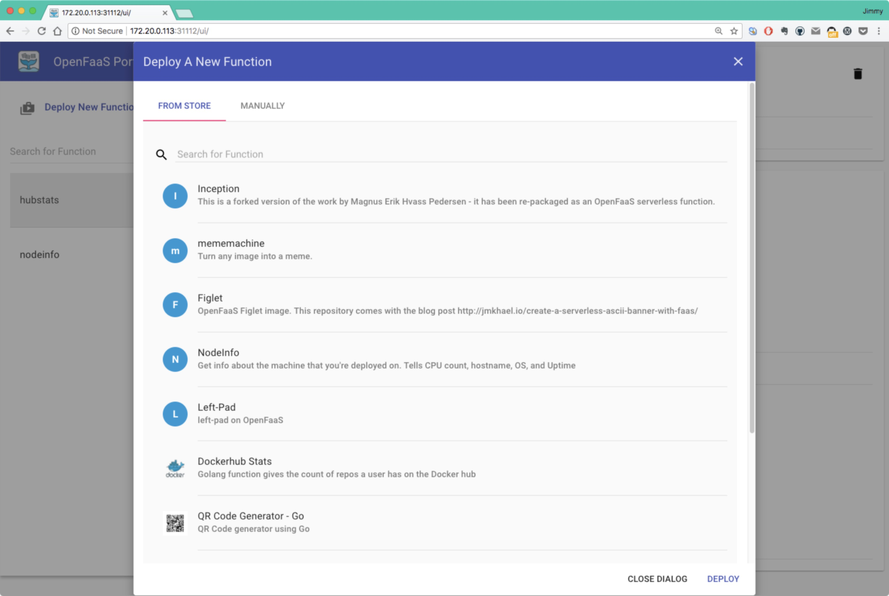

# OpenFaaS快速入门指南

[OpenFaaS](https://github.com/openfaas/faas)一款高人气的开源的faas框架，可以直接在Kubernetes上运行，也可以基于Swarm或容器运行。

在Kubernetes上部署OpenFaaS十分简单，用到的镜像如下：

- functions/faas-netesd:0.3.4
- functions/gateway:0.6.14
- functions/prometheus:latest-k8s
- functions/alertmanager:latest-k8s

这些镜像都存储在DockerHub上。

OpenFaaS的架构如下图：



## 部署

参考[Deployment guide for Kubernetes](https://github.com/openfaas/faas/blob/master/guide/deployment_k8s.md)部署OpenFaaS。

如果您的Kuberentes集群可以访问DockerHub那么直接使用官方提供的YAML文件即可。

YAML文件见官方仓库：https://github.com/openfaas/faas-netes

### 部署同步请求

一共用到了三个YAML文件：

- faas.yml
- monitoring.yml
- rbac.yml

**访问端口**

| 服务             | TCP端口 |
| -------------- | ----- |
| API Gateway/UI | 31112 |
| Prometheus     | 31119 |

OpenFaaS安装好后会启动一个Prometheus，使用31119端口，通过任意一个node可以访问UI：http://172.20.0.113:31119



在这里可以看到函数的运行情况。

同时OpenFaaS还提供了Dashboard，需要我们自己向Grafana中配置Prometheus数据源后导入，JSON配置见：<https://grafana.com/dashboards/3526>，可以下载后直接导入到Grafana中。



## OpenFaaS的使用

OpenFaaS提供了便捷的UI，在部署完成后就可以通过NodePort方式访问。

使用API Gateway的端口，通过任意一个node可以访问UI：http://172.20.0.113:31112



其中已经内置了一些函数应用可供我们试用，还可以创建自己的函数。

比如内置的`NodeInfo`应用，可以获取该应用所部署到的主机的信息，如下图：


**注意：**有一些js和css文件需要翻墙才能访问，否则页面将出现格式错误。

### 命令行工具

OpenFaaS提供了命令行工具[faas-cli](https://github.com/openfaas/faas-cli)，使用该工具可以管理OpenFaaS中的函数。

可以到[openfaas GitHub release](https://github.com/openfaas/faas-cli/releases)下载对应操作系统的命令行工具。或者使用下面的命令安装最新faas-cli：

```bash
curl -sL cli.openfaas.com | sudo sh
```

### faas-cli命令说明

下面是`faas-cli`命令的几个使用案例。

获取当前部署的函数状态：

```bash
faas-cli list --gateway http://172.20.0.113:31112
Function                      	Invocations    	Replicas
hubstats                      	0              	1
nodeinfo                      	0              	1
```

调用函数nodeinfo：

```bash
echo ""|faas-cli invoke nodeinfo --gateway http://172.20.0.113:31112
Hostname: nodeinfo-699d4bdcbc-s2jfz

Platform: linux
Arch: x64
CPU count: 40
Uptime: 1728200
```

OpenFaaS的命令行工具`faas-cli`的详细使用说明见：https://github.com/openfaas/faas-cli

## 参考

- [Deployment guide for Kubernetes - GitHub openfaas/faas](http://docs.openfaas.com/deployment/kubernetes/)