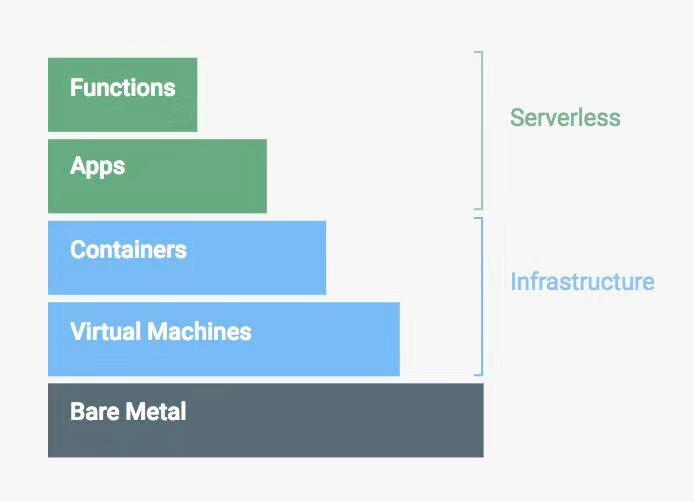
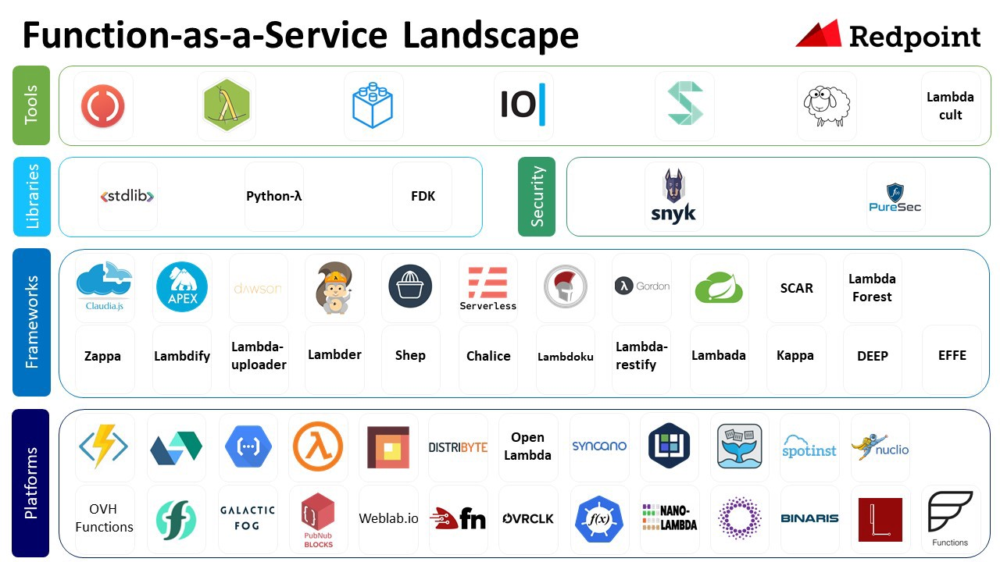

# Serverless架构

就像无线互联网实际有的地方也需要用到有线连接一样，无服务器架构仍然在某处有服务器。Serverless（无服务器架构）指的是由开发者实现的服务端逻辑运行在无状态的计算容器中，它由事件触发， 完全被第三方管理，其业务层面的状态则被开发者使用的数据库和存储资源所记录。

CNCF 的[云原生 landscape](https://github.com/cncf/landscape) 中就包括 Serverless 附图，这也是云原生发展到更高阶段的面向特定应用场景的简易抽象。

下图来自谷歌云平台官网，是对云计算的一个很好的分层概括，其中 serverless 就是构建在虚拟机和容器之上的一层，与应用本身的关系更加密切。

### Serverless架构的优点

今天大多数公司在开发应用程序并将其部署在服务器上的时候，无论是选择公有云还是私有的数据中心，都需要提前了解究竟需要多少台服务器、多大容量的存储和数据库的功能等。并需要部署运行应用程序和依赖的软件到基础设施之上。假设我们不想在这些细节上花费精力，是否有一种简单的架构模型能够满足我们这种想法？这个答案已经存在，这就是今天软件架构世界中新鲜但是很热门的一个话题——Serverless（无服务器）架构。

——AWS 费良宏

- **降低运营成本：**

Serverless是非常简单的外包解决方案。它可以让您委托服务提供商管理服务器、数据库和应用程序甚至逻辑，否则您就不得不自己来维护。由于这个服务使用者的数量会非常庞大，于是就会产生规模经济效应。在降低成本上包含了两个方面，即基础设施的成本和人员（运营/开发）的成本。

- **降低开发成本：**

IaaS和PaaS存在的前提是，服务器和操作系统管理可以商品化。Serverless作为另一种服务的结果是整个应用程序组件被商品化。

- **扩展能力：**

Serverless架构一个显而易见的优点即“横向扩展是完全自动的、有弹性的、且由服务提供者所管理”。从基本的基础设施方面受益最大的好处是，您只需支付您所需要的计算能力。

- **更简单的管理：**

Serverless架构明显比其他架构更简单。更少的组件，就意味着您的管理开销会更少。

- **“绿色”的计算：**

按照《福布斯》杂志的统计，在商业和企业数据中心的典型服务器仅提供5%～15%的平均最大处理能力的输出。这无疑是一种资源的巨大浪费。随着Serverless架构的出现，让服务提供商提供我们的计算能力最大限度满足实时需求。这将使我们更有效地利用计算资源。

## Kubernetes上的serverless 架构

目前已经有一批优秀的基于 kubernetes 的 serverless 架构（FaaS）开源项目如下：

- [faas](https://github.com/alexellis/faas) - 🐳 Functions as a Service - a serverless framework for Docker & Kubernetes [https://blog.alexellis.io/introducing…](https://blog.alexellis.io/introducing-functions-as-a-service/)
- [faas-netes](https://github.com/alexellis/faas-netes) - Enable Kubernetes as a backend for Functions as a Service (OpenFaaS) <https://github.com/alexellis/faas>
- [fn](https://github.com/fnproject/fn) - The container native, cloud agnostic serverless platform. [http://fnproject.io](http://fnproject.io/)
- [funktion](https://github.com/funktionio/funktion/) - a CLI tool for working with funktion <https://funktion.fabric8.io/>
- [fx](https://github.com/metrue/fx) - Poor man's serverless framework based on Docker, Function as a Service with painless.
- [IronFunctions](https://github.com/iron-io/functions) - IronFunctions - the serverless microservices platform. [http://iron.io](http://iron.io/)
- [knative](https://github.com/knative) - Kubernetes-based platform to build, deploy, and manage modern serverless workloads
- [kubeless](https://github.com/kubeless/kubeless) - Kubernetes Native Serverless Framework [http://kubeless.io](http://kubeless.io/)
- [OpenWhisk](http://openwhisk.incubator.apache.org/) -  Apache OpenWhisk (Incubating) is a serverless, open source cloud platform that executes functions in response to events at any scale.

以上项目收录于 [awsome-cloud-native](https://github.com/rootsongjc/awesome-cloud-native)。

## FaaS

Function-as-a-Service景观图（图片来自`https://github.com/amyers1793/FunctionasaServiceLandscape`)

## 参考

- [Why Serverless? - serverless.com](https://serverless.com/learn/)
- [Serverless Architectures - Martin Fowler](https://martinfowler.com/articles/serverless.html)
- [Serverless架构综述](http://dockone.io/article/1460)
- [2017年会是Serverless爆发之年吗？](http://www.infoq.com/cn/news/2017/04/2017-Serverless)
- [从IaaS到FaaS—— Serverless架构的前世今生](https://aws.amazon.com/cn/blogs/china/iaas-faas-serverless/)
- [Introducing Redpoint's FaaS Landscape](https://medium.com/memory-leak/this-year-gartner-added-serverless-to-its-hype-cycle-of-emerging-technologies-reflecting-the-5dfe43d818f0)