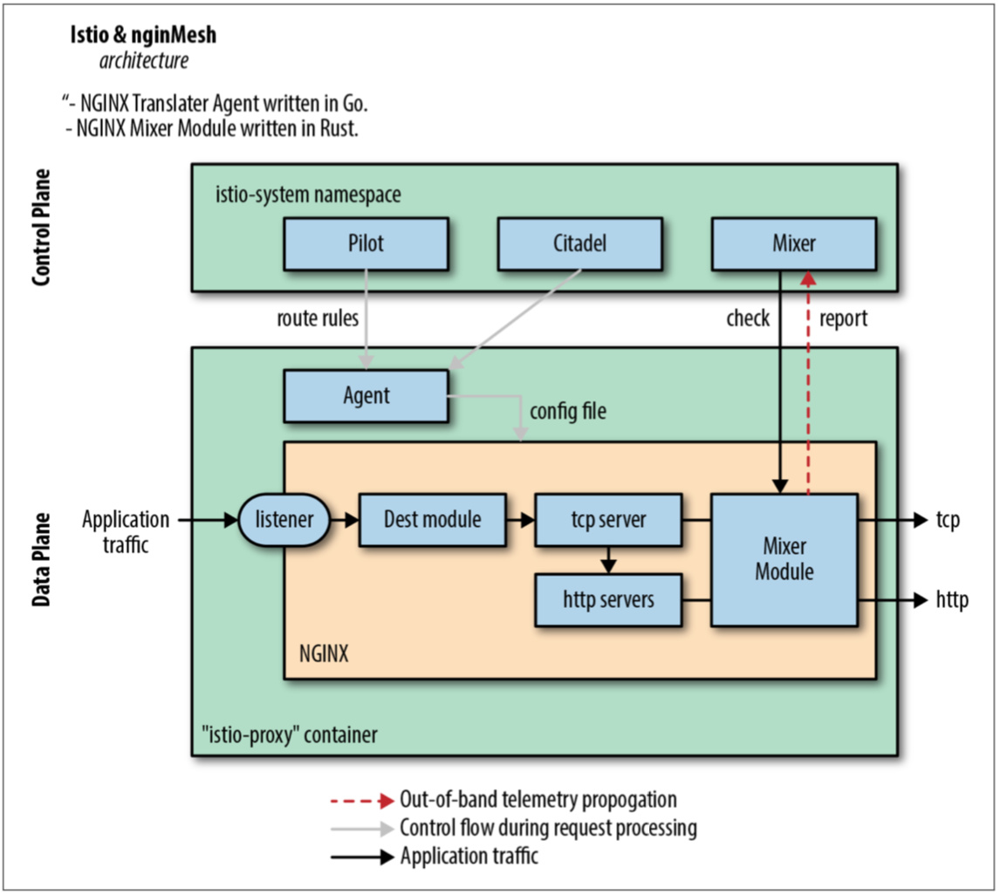
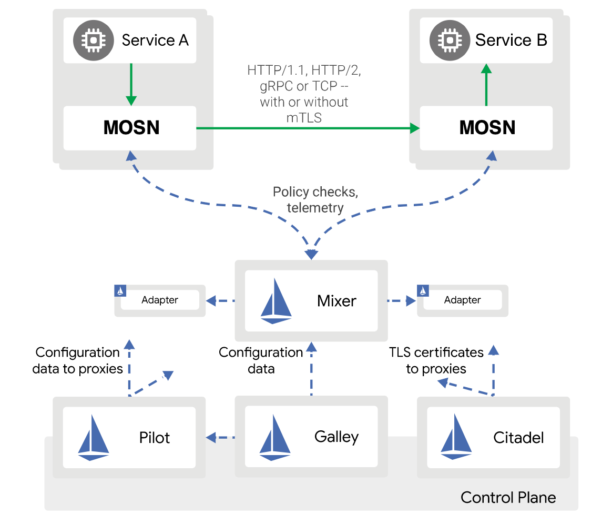

# 定制和集成

例如 Istio 这样的 Service Mesh 中有很多地方可以给大家定制，例如作为数据平面的 sidecar，虽然默认使用的是 Envoy，但是你可以开发自己的 sidecar 代理。

当前可选择的开源的代理可以在 [Service Mesh Landscape](https://layer5.io/service-mesh-landscape) 里找到，例如使用 nginMesh 替代 Envoy 作为数据平面。下图是使用 nginMesh 作为 sidecar 的架构图。

## nginMesh

## MOSN

还有蚂蚁集团开源的 Go 语言版的数据平面 [MOSN](https://github.com/mosn/mosn)，同时兼容 Istio，也可以单独作为代理使用，详见[在 Istio 中使用 MOSN：另一个数据平面](https://istio.io/latest/zh/blog/2020/mosn-proxy/)。

## 参考

- [在 Istio 中使用 MOSN：另一个数据平面 - istio.io](https://istio.io/latest/zh/blog/2020/mosn-proxy/)