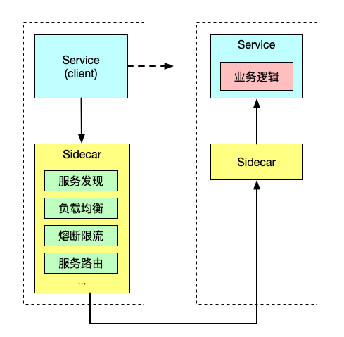

# Sidecar 模式

将应用程序的功能划分为单独的进程运行在同一个最小调度单元中（例如 Kubernetes 中的 Pod）可以被视为 **sidecar 模式**。如下图所示，sidecar 模式允许您在应用程序旁边添加更多功能，而无需额外第三方组件配置或修改应用程序代码。

就像连接了 Sidecar 的三轮摩托车一样，在软件架构中， Sidecar 连接到父应用并且为其添加扩展或者增强功能。Sidecar 应用与主应用程序松散耦合。它可以屏蔽不同编程语言的差异，统一实现微服务的可观察性、监控、日志记录、配置、断路器等功能。

### 使用 Sidecar 模式的优势

使用 sidecar 模式部署服务网格时，无需在节点上运行代理，但是集群中将运行多个相同的 sidecar 副本。在 sidecar 部署方式中，每个应用的容器旁都会部署一个伴生容器，这个容器称之为 sidecar 容器。Sidecar 接管进出应用容器的所有流量。在 Kubernetes 的 Pod 中，在原有的应用容器旁边注入一个 Sidecar 容器，两个容器共享存储、网络等资源，可以广义的将这个包含了 sidecar 容器的 Pod 理解为一台主机，两个容器共享主机资源。

因其独特的部署结构，使得 sidecar 模式具有以下优势：

- 将与应用业务逻辑无关的功能抽象到共同基础设施，降低了微服务代码的复杂度。
- 因为不再需要编写相同的第三方组件配置文件和代码，所以能够降低微服务架构中的代码重复度。
- Sidecar 可独立升级，降低应用程序代码和底层平台的耦合度。
