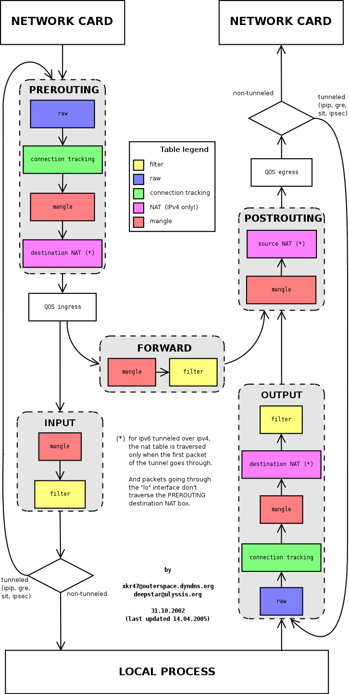

# Sidecar 的注入与透明流量劫持

Istio 中提供了以下两种 sidecar 注入方式：

- 使用 `istioctl` 手动注入。
- 基于 Kubernetes 的 [突变 webhook 准入控制器（mutating webhook addmission controller](https://kubernetes.io/docs/reference/access-authn-authz/admission-controllers/) 的自动 sidecar 注入方式。

不论是手动注入还是自动注入，sidecar 的注入过程都需要遵循如下步骤：

1. Kubernetes 需要了解待注入的 sidecar 所连接的 Istio 集群及其配置；
1. Kubernetes 需要了解待注入的 sidecar 容器本身的配置，如镜像地址、启动参数等；
1. Kubernetes 根据 sidecar 注入模板和以上配置填充 sidecar 的配置参数，将以上配置注入到应用容器的一侧；

使用下面的命令可以手动注入 sidecar。

```bash
istioctl kube-inject -f ${YAML_FILE} | kuebectl apply -f -
```

该命令会使用 Istio 内置的 sidecar 配置来注入，下面使用 Istio详细配置请参考 [Istio 官网](https://istio.io/docs/setup/additional-setup/sidecar-injection/#manual-sidecar-injection)。

注入完成后您将看到 Istio 为原有 pod template 注入了 `initContainer` 及 sidecar proxy相关的配置。

## Init 容器

Init 容器是一种专用容器，它在应用程序容器启动之前运行，用来包含一些应用镜像中不存在的实用工具或安装脚本。

一个 Pod 中可以指定多个 Init 容器，如果指定了多个，那么 Init 容器将会按顺序依次运行。只有当前面的 Init 容器必须运行成功后，才可以运行下一个 Init 容器。当所有的 Init 容器运行完成后，Kubernetes 才初始化 Pod 和运行应用容器。

Init 容器使用 Linux Namespace，所以相对应用程序容器来说具有不同的文件系统视图。因此，它们能够具有访问 Secret 的权限，而应用程序容器则不能。

在 Pod 启动过程中，Init 容器会按顺序在网络和数据卷初始化之后启动。每个容器必须在下一个容器启动之前成功退出。如果由于运行时或失败退出，将导致容器启动失败，它会根据 Pod 的 `restartPolicy` 指定的策略进行重试。然而，如果 Pod 的 `restartPolicy` 设置为 Always，Init 容器失败时会使用 `RestartPolicy` 策略。

在所有的 Init 容器没有成功之前，Pod 将不会变成 `Ready` 状态。Init 容器的端口将不会在 Service中进行聚集。 正在初始化中的 Pod 处于 `Pending` 状态，但应该会将 `Initializing` 状态设置为 true。Init 容器运行完成以后就会自动终止。

关于 Init 容器的详细信息请参考 [Init 容器 - Kubernetes 中文指南/云原生应用架构实践手册](https://jimmysong.io/kubernetes-handbook/concepts/init-containers.html)。

## Sidecar 注入示例分析

本文我们将以 Istio 官方示例 `bookinfo` 中 `reivews` 服务为例，来接讲解 Sidecar 容器注入的额流程，每个注入了 Sidecar 的 Pod 中除了原先应用的应用本身的容器外，都会多出来这样两个容器：

- `istio-init`：用于给 Sidecar 容器即 Envoy 代理做初始化，设置 iptables 端口转发
- `istio-proxy`：Envoy 代理容器，运行 Envoy 代理

接下来将分别解析下这两个容器。

### Init 容器解析

Istio 在 Pod 中注入的 Init 容器名为 `istio-init`，如果你查看 `reviews` Deployment 配置，你将看到其中 `initContaienrs` 的启动参数：

```bash
      initContainers:
        - name: istio-init
          image: docker.io/istio/proxyv2:1.13.1
          args:
            - istio-iptables
            - '-p'
            - '15001'
            - '-z'
            - '15006'
            - '-u'
            - '1337'
            - '-m'
            - REDIRECT
            - '-i'
            - '*'
            - '-x'
            - ''
            - '-b'
            - '*'
            - '-d'
            - 15090,15021,15020
```

我们看到 `istio-init` 容器的入口是 `istio-iptables` 命令，该命令是用于初始化路由表的。

### Init 容器启动入口

Init 容器的启动入口是 `/usr/local/bin/istio-iptable` 命令，该命令的用法如下：

```bash
$ istio-iptables -p PORT -u UID -g GID [-m mode] [-b ports] [-d ports] [-i CIDR] [-x CIDR] [-h]
  -p: 指定重定向所有 TCP 流量的 Envoy 端口（默认为 $ENVOY_PORT = 15001）
  -u: 指定未应用重定向的用户的 UID。通常，这是代理容器的 UID（默认为 $ENVOY_USER 的 uid，istio_proxy 的 uid 或 1337）
  -g: 指定未应用重定向的用户的 GID。（与 -u param 相同的默认值）
  -m: 指定入站连接重定向到 Envoy 的模式，“REDIRECT” 或 “TPROXY”（默认为 $ISTIO_INBOUND_INTERCEPTION_MODE)
  -b: 逗号分隔的入站端口列表，其流量将重定向到 Envoy（可选）。使用通配符 “*” 表示重定向所有端口。为空时表示禁用所有入站重定向（默认为 $ISTIO_INBOUND_PORTS）
  -d: 指定要从重定向到 Envoy 中排除（可选）的入站端口列表，以逗号格式分隔。使用通配符“*” 表示重定向所有入站流量（默认为 $ISTIO_LOCAL_EXCLUDE_PORTS）
  -i: 指定重定向到 Envoy（可选）的 IP 地址范围，以逗号分隔的 CIDR 格式列表。使用通配符 “*” 表示重定向所有出站流量。空列表将禁用所有出站重定向（默认为 $ISTIO_SERVICE_CIDR）
  -x: 指定将从重定向中排除的 IP 地址范围，以逗号分隔的 CIDR 格式列表。使用通配符 “*” 表示重定向所有出站流量（默认为 $ISTIO_SERVICE_EXCLUDE_CIDR）。
  -z: 所有入站 TCP 流量重定向端口（默认为 $INBOUND_CAPTURE_PORT 15006）
```

关于该命令的详细代码请[查看 GitHub：`tools/istio-iptables/pkg/cmd/root.go`](https://github.com/istio/istio/blob/master/tools/istio-iptables/pkg/cmd/root.go)。

再参考 `istio-init` 容器的启动参数，完整的启动命令如下：

```bash
$ /usr/local/bin/istio-iptables -p 15001 -z 15006 -u 1337 -m REDIRECT -i '*' -x "" -b * -d "15090,15201,15020"
```

该容器存在的意义就是让 Envoy 代理可以拦截所有的进出 Pod 的流量，即将入站流量重定向到 Sidecar，再拦截应用容器的出站流量经过 Sidecar 处理后再出站。

**命令解析**

这条启动命令的作用是：

- 将应用容器的所有流量都转发到 Envoy 的 15006 端口。
- 使用 `istio-proxy` 用户身份运行， UID 为 1337，即 Envoy 所处的用户空间，这也是 `istio-proxy` 容器默认使用的用户，见 YAML 配置中的 `runAsUser` 字段。
- 使用默认的 `REDIRECT` 模式来重定向流量。
- 将所有出站流量都重定向到 Envoy 代理。
- 将除了 15090、15201、15020 端口以外的所有端口的流量重定向到 Envoy 代理。

因为 Init 容器初始化完毕后就会自动终止，因为我们无法登陆到容器中查看 iptables 信息，但是 Init 容器初始化结果会保留到应用容器和 Sidecar 容器中。

### istio-proxy 容器解析

为了查看 iptables 配置，我们需要登陆到 Sidecar 容器中使用 root 用户来查看，因为 `kubectl` 无法使用特权模式来远程操作 docker 容器，所以我们需要登陆到 `reviews` Pod 所在的主机上使用 `docker` 命令登陆容器中查看。

查看 `reviews` Pod 所在的主机。

```bash
$ kubectl -n default get pod -l app=reviews -o wide
NAME                              READY     STATUS    RESTARTS   AGE       IP             NODE
reviews-v1-745ffc55b7-2l2lw   2/2       Running   0          1d        172.33.78.10   node3
```

从输出结果中可以看到该 Pod 运行在 `node3` 上，使用 `vagrant` 命令登陆到 `node3` 主机中并切换为 root 用户。

```bash
$ vagrant ssh node3
$ sudo -i
```

查看 iptables 配置，列出 NAT（网络地址转换）表的所有规则，因为在 Init 容器启动的时候选择给 `istio-iptables.sh` 传递的参数中指定将入站流量重定向到 Envoy 的模式为 “REDIRECT”，因此在 iptables 中将只有 NAT 表的规格配置，如果选择 `TPROXY` 还会有 `mangle` 表配置。`iptables` 命令的详细用法请参考 [iptables](https://wangchujiang.com/linux-command/c/iptables.html)，规则配置请参考 [iptables 规则配置](http://www.zsythink.net/archives/1517)。

## 理解 iptables

`iptables` 是 Linux 内核中的防火墙软件 netfilter 的管理工具，位于用户空间，同时也是 netfilter 的一部分。Netfilter 位于内核空间，不仅有网络地址转换的功能，也具备数据包内容修改、以及数据包过滤等防火墙功能。

在了解 Init 容器初始化的 iptables 之前，我们先来了解下 iptables 和规则配置。

下图展示了 iptables 调用链。



### iptables 中的表

Init 容器中使用的的 iptables 版本是 `v1.6.0`，共包含 5 张表：

1. `raw` 用于配置数据包，`raw` 中的数据包不会被系统跟踪。
2. `filter` 是用于存放所有与防火墙相关操作的默认表。
3. `nat` 用于 [网络地址转换](https://en.wikipedia.org/wiki/Network_address_translation)（例如：端口转发）。
4. `mangle` 用于对特定数据包的修改（参考[损坏数据包](https://en.wikipedia.org/wiki/Mangled_packet)）。
5. `security` 用于[强制访问控制](https://wiki.archlinux.org/index.php/Security#Mandatory_access_control) 网络规则。

**注**：在本示例中只用到了 `nat` 表。

不同的表中的具有的链类型如下表所示：

| 规则名称    | raw  | filter | nat  | mangle | security |
| ----------- | ---- | ------ | ---- | ------ | -------- |
| PREROUTING  | ✓    |        | ✓    | ✓      |          |
| INPUT       |      | ✓      | ✓    | ✓      | ✓        |
| OUTPUT      |      | ✓      | ✓    | ✓      | ✓        |
| POSTROUTING |      |        | ✓    | ✓      |          |
| FORWARD     | ✓    | ✓      |      | ✓      | ✓        |

下图是 iptables 的调用链顺序。


### iptables 命令

`iptables` 命令的主要用途是修改这些表中的规则。`iptables` 命令格式如下：

```bash
$ iptables [-t 表名] 命令选项［链名]［条件匹配］[-j 目标动作或跳转］
```

Init 容器中的 `/istio-iptables.sh` 启动入口脚本就是执行 iptables 初始化的。

### 理解 iptables 规则

查看 `istio-proxy` 容器中的默认的 iptables 规则，默认查看的是 filter 表中的规则。

```bash
$ iptables -L -v
Chain INPUT (policy ACCEPT 350K packets, 63M bytes)
 pkts bytes target     prot opt in     out     source               destination

Chain FORWARD (policy ACCEPT 0 packets, 0 bytes)
 pkts bytes target     prot opt in     out     source               destination

Chain OUTPUT (policy ACCEPT 18M packets, 1916M bytes)
 pkts bytes target     prot opt in     out     source               destination
```

我们看到三个默认的链，分别是 INPUT、FORWARD 和 OUTPUT，每个链中的第一行输出表示链名称（在本例中为 INPUT/FORWARD/OUTPUT），后跟默认策略（ACCEPT）。

每条链中都可以添加多条规则，规则是按照顺序从前到后执行的。我们来看下规则的表头定义。

- **pkts**：处理过的匹配的报文数量
- **bytes**：累计处理的报文大小（字节数）
- **target**：如果报文与规则匹配，指定目标就会被执行。
- **prot**：协议，例如 `tdp`、`udp`、`icmp` 和 `all`。
- **opt**：很少使用，这一列用于显示 IP 选项。
- **in**：入站网卡。
- **out**：出站网卡。
- **source**：流量的源 IP 地址或子网，后者是 `anywhere`。
- **destination**：流量的目的地 IP 地址或子网，或者是 `anywhere`。

还有一列没有表头，显示在最后，表示规则的选项，作为规则的扩展匹配条件，用来补充前面的几列中的配置。`prot`、`opt`、`in`、`out`、`source` 和 `destination` 和显示在 `destination` 后面的没有表头的一列扩展条件共同组成匹配规则。当流量匹配这些规则后就会执行 `target`。

**target 支持的类型**

`target` 类型包括 ACCEPT`、REJECT`、`DROP`、`LOG` 、`SNAT`、`MASQUERADE`、`DNAT`、`REDIRECT`、`RETURN` 或者跳转到其他规则等。只要执行到某一条链中只有按照顺序有一条规则匹配后就可以确定报文的去向了，除了 `RETURN` 类型，类似编程语言中的 `return` 语句，返回到它的调用点，继续执行下一条规则。`target` 支持的配置详解请参考 [iptables 详解（1）：iptables 概念](http://www.zsythink.net/archives/1199)。

从输出结果中可以看到 Init 容器没有在 iptables 的默认链路中创建任何规则，而是创建了新的链路。

## 查看 iptables nat 表中注入的规则

Init 容器通过向 iptables nat 表中注入转发规则来劫持流量的，下图显示的是三个 reviews 服务示例中的某一个 Pod，其中有 init 容器、应用容器和 sidecar 容器，图中展示了 iptables 流量劫持的详细过程。


Init 容器启动时命令行参数中指定了 `REDIRECT` 模式，因此只创建了 NAT 表规则，接下来我们查看下 NAT 表中创建的规则，这是全文中的**重点部分**，前面讲了那么多都是为它做铺垫的。

### 进入到 reviews pod

Reviews 服务有三个版本，我们进入到其中任意一个版本，例如 reviews-1，首先你需要搞清楚这个 pod 运行在哪个节点上，知道那个容器的具体 ID，然后使用 SSH 登录那个节点，使用 `ps` 命令查看到那个容器的具体 PID，使用 `nsenter` 命令进入该容器。

```sh
nsenter -t{PID} -n
```

**为什么不直接使用 kubectl 进入容器？**

Istio 向 pod 中自动注入的 sidecar 容器（名为 `istio-proxy`）其中默认的用户是 `istio-proxy`，该用户没有权限查看路由表规则，即当你在该容器中运行 `iptabes` 命令时会得到 `iptables -t nat -L -v` 这样的结果，而且你又没有 root 权限。对于 reviews 容器也是一样，默认用户的 UID 是 `1000`，而且这个用户又没有名字，一样也无法切换为 root 用户，系统中默认没有安装 iptabels 命令。所以我们只能登录到 Pod 的宿主节点上，使用 `nsenter` 命令进入容器内部。

### 查看路由表

下面是查看 nat 表中的规则，其中链的名字中包含 `ISTIO` 前缀的是由 Init 容器注入的，规则匹配是根据下面显示的顺序来执行的，其中会有多次跳转。

```bash
# PREROUTING 链：用于目标地址转换（DNAT），将所有入站 TCP 流量跳转到 ISTIO_INBOUND 链上。
Chain PREROUTING (policy ACCEPT 2701 packets, 162K bytes)
 pkts bytes target     prot opt in     out     source               destination
 2701  162K ISTIO_INBOUND  tcp  --  any    any     anywhere             anywhere

# INPUT 链：处理输入数据包，非 TCP 流量将继续 OUTPUT 链。
Chain INPUT (policy ACCEPT 2701 packets, 162K bytes)
 pkts bytes target     prot opt in     out     source               destination

# OUTPUT 链：将所有出站数据包跳转到 ISTIO_OUTPUT 链上。
Chain OUTPUT (policy ACCEPT 79 packets, 6761 bytes)
 pkts bytes target     prot opt in     out     source               destination
   15   900 ISTIO_OUTPUT  tcp  --  any    any     anywhere             anywhere

# POSTROUTING 链：所有数据包流出网卡时都要先进入 POSTROUTING 链，内核根据数据包目的地判断是否需要转发出去，我们看到此处未做任何处理。
Chain POSTROUTING (policy ACCEPT 79 packets, 6761 bytes)
 pkts bytes target     prot opt in     out     source               destination

# ISTIO_INBOUND 链：将所有入站流量重定向到 ISTIO_IN_REDIRECT 链上。目的地为 15090（Prometheus 使用）和 15020（Ingress gateway 使用，用于 Pilot 健康检查）端口的流量除外，发送到以上两个端口的流量将返回 iptables 规则链的调用点，即 PREROUTING 链的后继 POSTROUTING 后直接调用原始目的地。
Chain ISTIO_INBOUND (1 references)
 pkts bytes target     prot opt in     out     source               destination
    0     0 RETURN     tcp  --  any    any     anywhere             anywhere             tcp dpt:ssh
    2   120 RETURN     tcp  --  any    any     anywhere             anywhere             tcp dpt:15090
 2699  162K RETURN     tcp  --  any    any     anywhere             anywhere             tcp dpt:15020
    0     0 ISTIO_IN_REDIRECT  tcp  --  any    any     anywhere             anywhere

# ISTIO_IN_REDIRECT 链：将所有的入站流量跳转到本地的 15006 端口，至此成功的拦截了流量到 sidecar 代理的 Inbound Handler 中。
Chain ISTIO_IN_REDIRECT (3 references)
 pkts bytes target     prot opt in     out     source               destination
    0     0 REDIRECT   tcp  --  any    any     anywhere             anywhere             redir ports 15006

# ISTIO_OUTPUT 链：规则比较复杂，将在下文解释
Chain ISTIO_OUTPUT (1 references)
 pkts bytes target     prot opt in     out     source               destination
    0     0 RETURN     all  --  any    lo      127.0.0.6            anywhere #规则1
    0     0 ISTIO_IN_REDIRECT  all  --  any    lo      anywhere            !localhost            owner UID match 1337 #规则2
    0     0 RETURN     all  --  any    lo      anywhere             anywhere             ! owner UID match 1337 #规则3
   15   900 RETURN     all  --  any    any     anywhere             anywhere             owner UID match 1337 #规则4
    0     0 ISTIO_IN_REDIRECT  all  --  any    lo      anywhere            !localhost            owner GID match 1337 #规则5
    0     0 RETURN     all  --  any    lo      anywhere             anywhere             ! owner GID match 1337 #规则6
    0     0 RETURN     all  --  any    any     anywhere             anywhere             owner GID match 1337 #规则7
    0     0 RETURN     all  --  any    any     anywhere             localhost #规则8
    0     0 ISTIO_REDIRECT  all  --  any    any     anywhere             anywhere #规则9

# ISTIO_REDIRECT 链：将所有流量重定向到 Envoy 代理的 15001 端口。
Chain ISTIO_REDIRECT (1 references)
 pkts bytes target     prot opt in     out     source               destination
    0     0 REDIRECT   tcp  --  any    any     anywhere             anywhere             redir ports 15001
```

这里着重需要解释的是 `ISTIO_OUTPUT` 链中的 9 条规则，为了便于阅读，我将以上规则中的部分内容使用表格的形式来展示如下：

| **规则** | **target**        | **in** | **out** | **source** | **destination**                 |
| -------- | ----------------- | ------ | ------- | ---------- | ------------------------------- |
| 1        | RETURN            | any    | lo      | 127.0.0.6  | anywhere                        |
| 2        | ISTIO_IN_REDIRECT | any    | lo      | anywhere   | !localhost owner UID match 1337 |
| 3        | RETURN            | any    | lo      | anywhere   | anywhere !owner UID match 1337  |
| 4        | RETURN            | any    | any     | anywhere   | anywhere owner UID match 1337   |
| 5        | ISTIO_IN_REDIRECT | any    | lo      | anywhere   | !localhost owner GID match 1337 |
| 6        | RETURN            | any    | lo      | anywhere   | anywhere !owner GID match 1337  |
| 7        | RETURN            | any    | any     | anywhere   | anywhere owner GID match 1337   |
| 8        | RETURN            | any    | any     | anywhere   | localhost                       |
| 9        | ISTIO_REDIRECT    | any    | any     | anywhere   | anywhere                        |

下图展示了 `ISTIO_ROUTE` 规则的详细流程。


我将按照规则的出现顺序来解释每条规则的目的、对应文章开头图示中的步骤及详情。其中规则 5、6、7 是分别对规则 2、3、4 的应用范围扩大（从 UID 扩大为 GID），作用是类似的，将合并解释。注意，其中的规则是按顺序执行的，也就是说排序越靠后的规则将作为默认值。出站网卡（out）为 `lo` （本地回环地址，loopback 接口）时，表示流量的目的地是本地 Pod，对于 Pod 向外部发送的流量就不会经过这个接口。所有 `review` Pod 的出站流量只适用于规则 4、7、8、9。

**规则 1**

- 目的：**透传** Envoy 代理发送到本地应用容器的流量，使其绕过 Envoy 代理，直达应用容器。
- 对应图示中的步骤：6 到 7。
- 详情：该规则使得所有来自 `127.0.0.6`（该 IP 地址将在下文解释） 的请求，跳出该链，返回 iptables 的调用点（即 `OUTPUT`）后继续执行其余路由规则，即 `POSTROUTING` 规则，把流量发送到任意目的地址，如本地 Pod 内的应用容器。如果没有这条规则，由 Pod 内 Envoy 代理发出的对 Pod 内容器访问的流量将会执行下一条规则，即规则 2，流量将再次进入到了 Inbound Handler 中，从而形成了死循环。将这条规则放在第一位可以避免流量在 Inbound Handler 中死循环的问题。

**规则 2、5**

- 目的：处理 Envoy 代理发出的站内流量（Pod 内部的流量），但不是对 localhost 的请求，通过后续规则将其转发给 Envoy 代理的 Inbound Handler。该规则适用于 Pod 对自身 IP 地址调用的场景。
- 对应图示中的步骤：6 到 7。
- 详情：如果流量的目的地非 localhost，且数据包是由 1337 UID（即 `istio-proxy` 用户，Envoy 代理）发出的，流量将被经过 `ISTIO_IN_REDIRECT` 最终转发到 Envoy 的 Inbound Handler。

**规则 3、6**

- 目的：**透传** Pod 内的应用容器的站内流量。适用于在应用容器中发出的对本地 Pod 的流量。
- 详情：如果流量不是由 Envoy 用户发出的，那么就跳出该链，返回 `OUTPUT` 调用 `POSTROUTING`，直达目的地。

**规则 4、7**

- 目的：**透传** Envoy 代理发出的出站请求。
- 对应图示中的步骤：14 到 15。
- 详情：如果请求是由 Envoy 代理发出的，则返回 `OUTPUT` 继续调用 `POSTROUTING` 规则，最终直接访问目的地。

**规则 8**

- 目的：**透传** Pod 内部对 localhost 的请求。
- 详情：如果请求的目的地是 localhost，则返回 OUTPUT 调用 `POSTROUTING`，直接访问 localhost。

**规则 9**

- 目的：所有其他的流量将被转发到 `ISTIO_REDIRECT` 后，最终达到 Envoy 代理的 Outbound Handler。

以上规则避免了 Envoy 代理到应用程序的路由在 iptables 规则中的死循环，保障了流量可以被正确的路由到 Envoy 代理上，也可以发出真正的出站请求。

**关于 RETURN target**

你可能留意到上述规则中有很多 RETURN target，它的意思是，指定到这条规则时，跳出该规则链，返回 iptables 的调用点（在我们的例子中即 `OUTPUT`）后继续执行其余路由规则，在我们的例子中即 `POSTROUTING` 规则，把流量发送到任意目的地址，你可以把它直观的理解为**透传**。

**关于 127.0.0.6 IP 地址**

127.0.0.6 这个 IP 是 Istio 中默认的 `InboundPassthroughClusterIpv4`，在 Istio 的代码中指定。即流量在进入 Envoy 代理后被绑定的 IP 地址，作用是让 Outbound 流量重新发送到 Pod 中的应用容器，即 **Passthought（透传），绕过 Outbound Handler**。该流量是对 Pod 自身的访问，而不是真正的对外流量。至于为什么选择这个 IP 作为流量透传，请参考 [Istio Issue-29603](https://github.com/istio/istio/issues/29603)。

## 使用 iptables 做流量劫持时存在的问题

目前 Istio 使用 iptables 实现透明劫持，主要存在以下三个问题：

1. 需要借助于 conntrack 模块实现连接跟踪，在连接数较多的情况下，会造成较大的消耗，同时可能会造成 track 表满的情况，为了避免这个问题，业内有关闭 conntrack 的做法。
1. iptables 属于常用模块，全局生效，不能显式的禁止相关联的修改，可管控性比较差。
1. iptables 重定向流量本质上是通过 loopback 交换数据，outbond 流量将两次穿越协议栈，在大并发场景下会损失转发性能。

上述几个问题并非在所有场景中都存在，比方说某些场景下，连接数并不多，且 NAT 表未被使用到的情况下，iptables 是一个满足要求的简单方案。为了适配更加广泛的场景，透明劫持需要解决上述三个问题。

## 透明劫持方案优化

为了优化 Istio 中的透明流量劫持的性能，业界提出了以下方案。

**使用 Merbridge 开源项目利用 eBPF 劫持流量**

[Merbridge](https://github.com/merbridge/merbridge) 是由 DaoCloud 在 2022 年初开源的的一款利用 eBPF 加速 Istio 服务网格的插件。使用 Merbridge 可以在一定程度上优化数据平面的网络性能。

Merbridge 利用 eBPF 的 sockops 和 redir 能力，可以直接将数据包从 inbound socket 传输到 outbound socket。eBPF 提供了 `bpf_msg_redirect_hash` 函数可以直接转发应用程序的数据包。

详见 [Istio 服务网格 —— 云原生应用网络构建指南](https://jimmysong.io/istio-handbook/ecosystem/merbridge.html)。

**使用 tproxy 处理 inbound 流量**

tproxy 可以用于 inbound 流量的重定向，且无需改变报文中的目的 IP/端口，不需要执行连接跟踪，不会出现 conntrack 模块创建大量连接的问题。受限于内核版本，tproxy 应用于 outbound 存在一定缺陷。目前 Istio 支持通过 tproxy 处理 inbound 流量。

**使用 hook connect 处理 outbound 流量**

为了适配更多应用场景，outbound 方向通过 hook connect 来实现，实现原理如下：


无论采用哪种透明劫持方案，均需要解决获取真实目的 IP/端口的问题，使用 iptables 方案通过 getsockopt 方式获取，tproxy 可以直接读取目的地址，通过修改调用接口，hook connect 方案读取方式类似于tproxy。

实现透明劫持后，在内核版本满足要求（4.16以上）的前提下，通过 sockmap 可以缩短报文穿越路径，进而改善 outbound 方向的转发性能。

## 参考

- [Debugging Envoy and Istiod - istio.io](https://istio.io/docs/ops/diagnostic-tools/proxy-cmd/)
- [揭开 Istio Sidecar 注入模型的神秘面纱 - istio.io](https://istio.io/latest/zh/blog/2019/data-plane-setup/)
- [MOSN 作为 Sidecar 使用时的流量劫持方案 - mosn.io](https://mosn.io/docs/products/structure/traffic-hijack/)
- [Istio 中的 Sidecar 注入、透明流量劫持及流量路由过程详解 - jimmysong.io](https://jimmysong.io/blog/sidecar-injection-iptables-and-traffic-routing/)
